# **LAPORAN PRAKTIKUM**


* Mata Kuliah: Pemrograman Framework
* Topik: Incremental Static Regeneration (ISR)
* Tujuan: Update halaman static tanpa build ulang


## **Langkah Praktikum**

### **C. Implementasi ISR Otomatis**

Menambahkan `revalidate` pada `getStaticProps`.


(Kode menunjukkan `revalidate: 10` artinya halaman diperbarui setiap 10 detik)

Penjelasan:

* Setiap 10 detik data akan dicek ulang
* Jika ada perubahan → cache diperbarui

---

### **2. Pengujian ISR**

Langkah:

1. Jalankan:

   * `npm run build`
   * `npm run start`
2. Tambahkan data baru di database Firebase

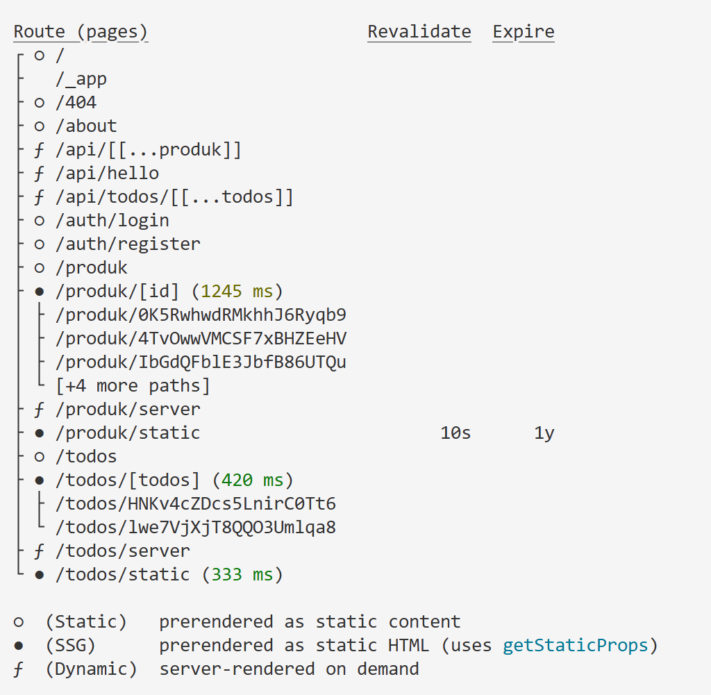**


Hasil:

* Sebelum 10 detik → data lama
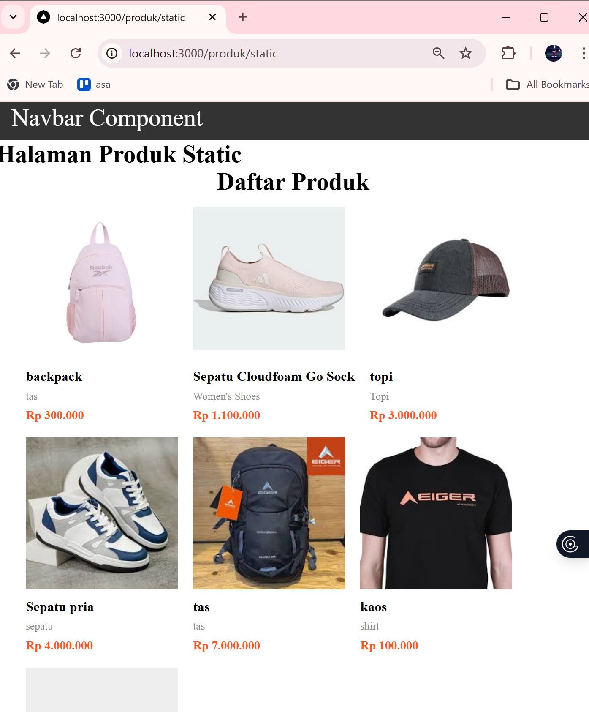

* Setelah 10 detik → data baru muncul


---

## **D. On-Demand Revalidation**

Digunakan untuk update tanpa menunggu waktu revalidate.

### **1. Membuat API Revalidate**


Penjelasan:

* Endpoint digunakan untuk trigger update manual
* Menggunakan `res.revalidate()`

---

### **2. Menambahkan Parameter**

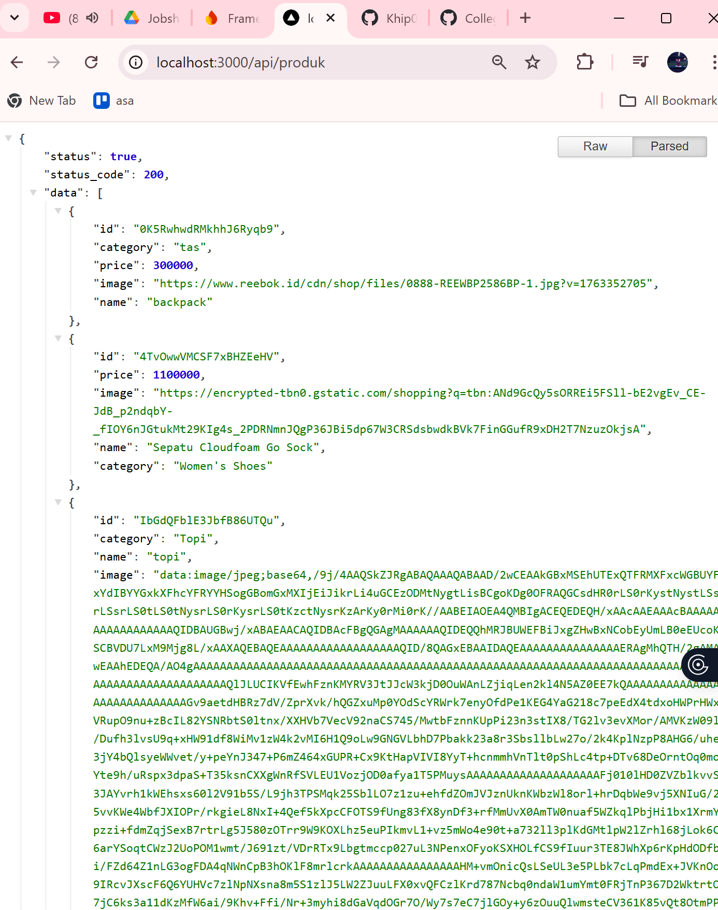

Contoh:

```
http://localhost:3000/api/revalidate?data=produk
```

Hasil:

* Jika benar → `revalidated: true`
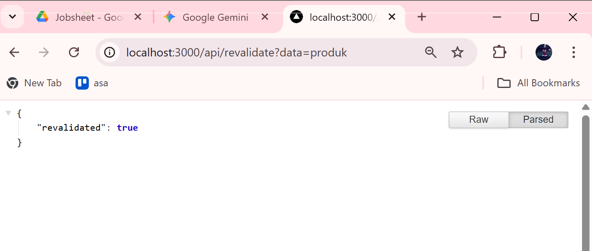

* Jika salah → error
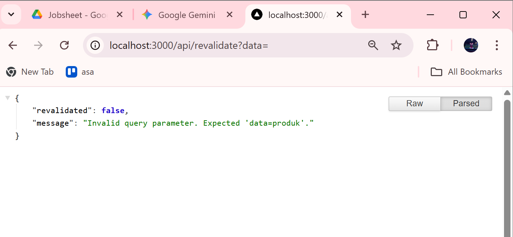


---

### **3. Menambahkan Token Security**

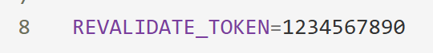

Penjelasan:

* Token digunakan untuk keamanan endpoint
* Mencegah akses sembarangan

---

## **E. Pengujian Manual**

Akses:

```
http://localhost:3000/api/revalidate?data=products&token=12345678
```

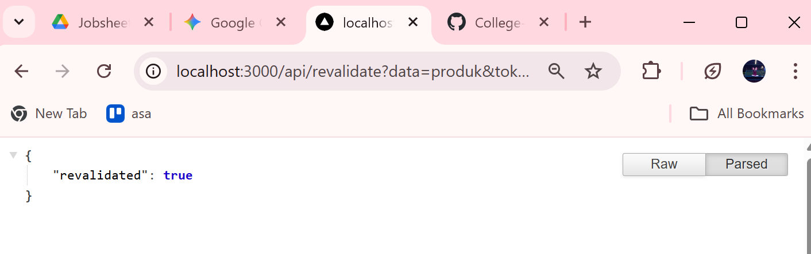
→ `revalidated: true`

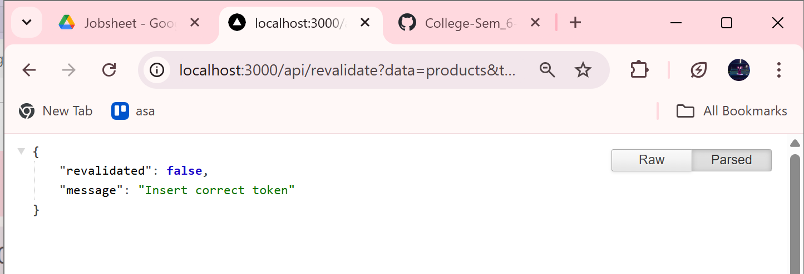
→ `revalidated: false`

---

## **G. Perbandingan SSG dan ISR**

| Aspek       | SSG               | ISR                |
| ----------- | ----------------- | ------------------ |
| Update Data | Harus build ulang | Otomatis / trigger |
| Cache       | Static permanen   | Static + refresh   |
| Cocok       | Konten tetap      | Semi-dinamis       |


---

## **G. Tugas Praktikum**

1. Tambahkan lagi produk pada firebase
[](https://drive.google.com/file/d/1Cmivds-nqzRsXFK9JyLWwLofdLM2JgFj/view?usp=sharing)

2. Implementasikan ISR dengan revalidate: 10.
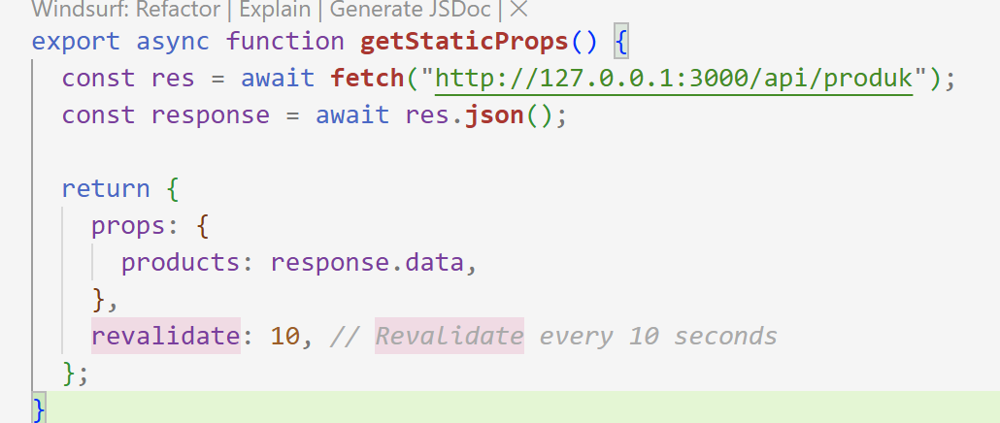
Hasilnya:


3. Tambahkan endpoint On-Demand Revalidation.

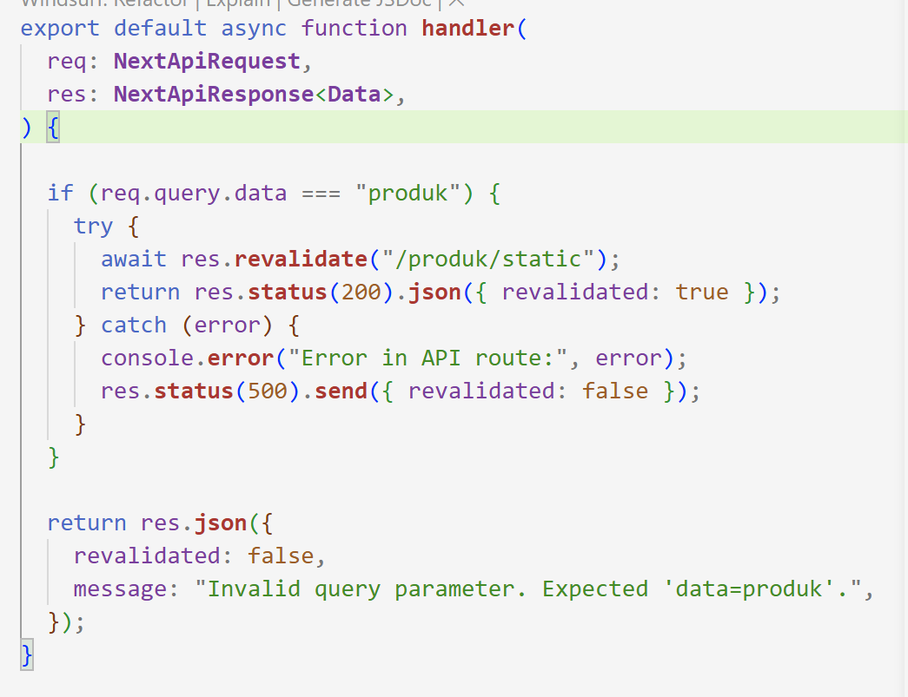


4. Tambahkan validasi token.

5. Uji dengan:

- Token benar:
    
    


- Token salah


- Tanpa token
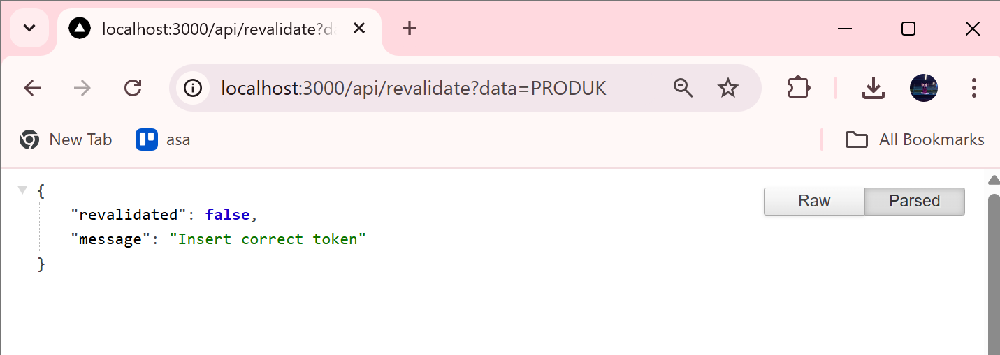
---

## **H. Analisis**


1. **Mengapa ISR lebih fleksibel dibanding SSG?**
   
   **Jawab:** ISR lebih fleksibel karena halaman bisa diperbarui tanpa perlu build ulang. Data dapat berubah otomatis setelah waktu tertentu atau saat di-trigger.

2. **Apa perbedaan revalidate waktu dan on-demand?**
   
   **Jawab:** Revalidate waktu berjalan otomatis sesuai interval, sedangkan on-demand dilakukan manual melalui API saat dibutuhkan.


3. **Mengapa endpoint revalidation harus diamankan?**
   
   **Jawab:** Agar tidak disalahgunakan oleh pihak luar yang bisa memicu update sembarangan.


4. **Apa risiko jika token tidak digunakan?**
   
   **Jawab:** Endpoint bisa diakses siapa saja, sehingga rawan spam dan manipulasi data.

5. **Kapan ISR lebih cocok dibanding SSR?**
   
   **Jawab:** Saat data tidak perlu real-time, tapi tetap perlu update berkala dengan performa cepat.


---
