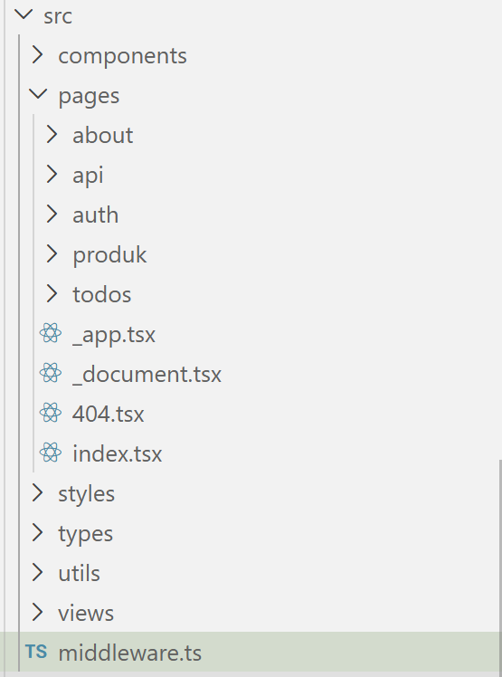
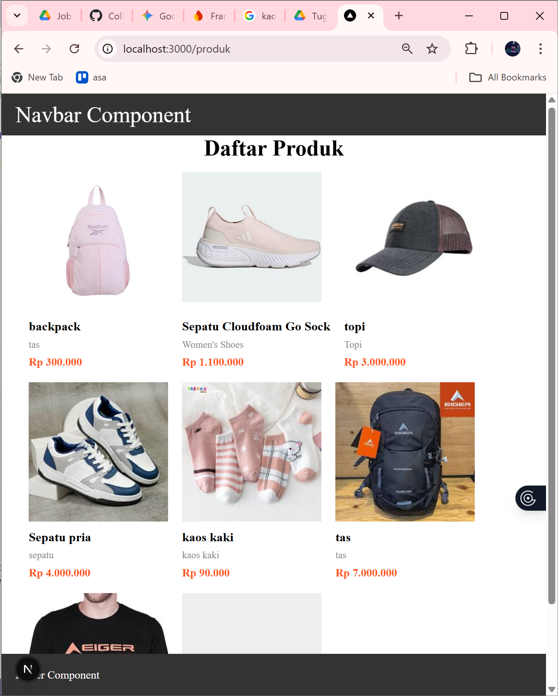
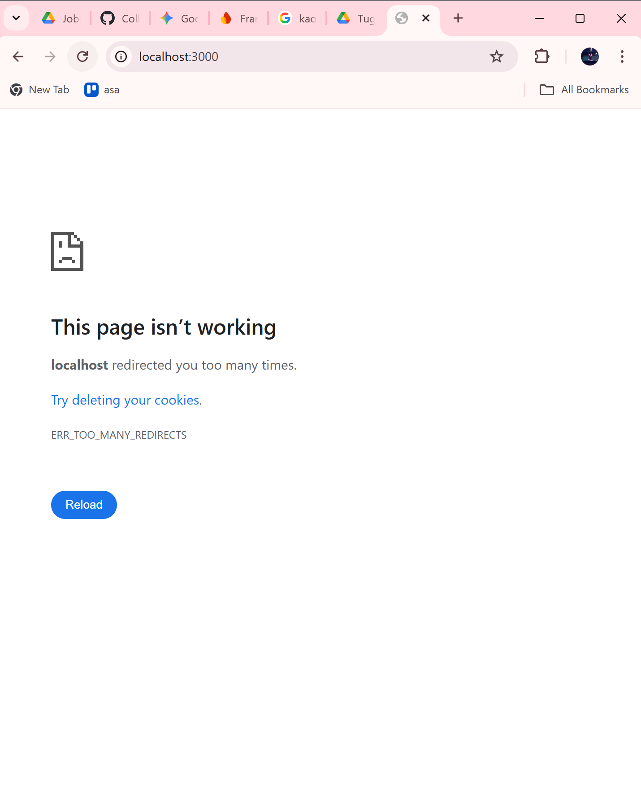
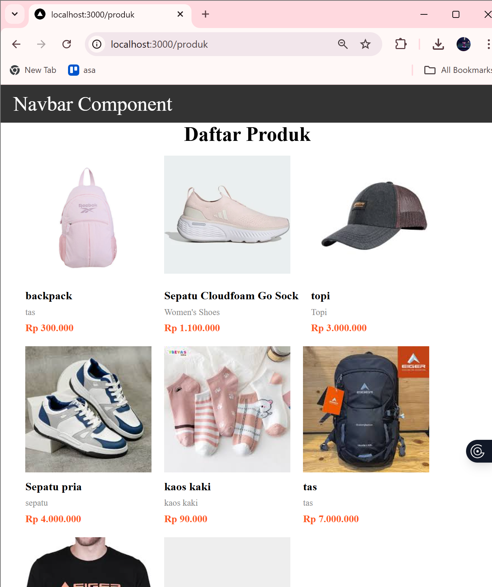
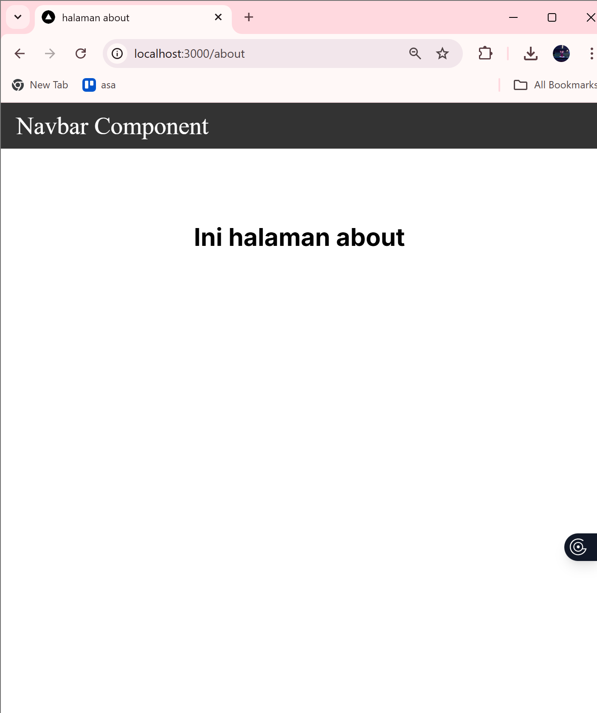
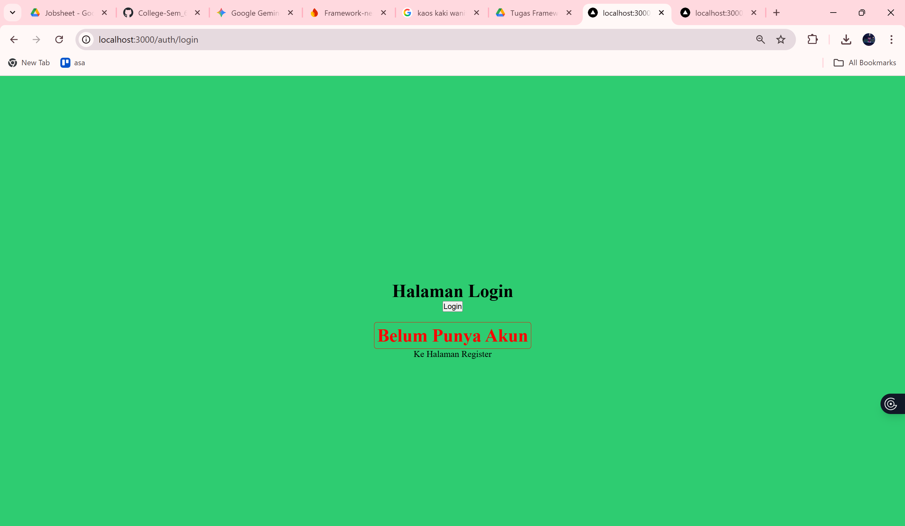

# **LAPORAN PRAKTIKUM**

* Mata Kuliah: Pemrograman Framework
* Topik: Middleware & Route Protection
* Tujuan: Proteksi halaman menggunakan Middleware


## **Langkah Praktikum**

### **1. Membuat Middleware**

* Membuat file `middleware.ts` di folder `src`



---

### **2. Struktur Dasar Middleware**

Menggunakan:

```ts
return NextResponse.next()
```

Artinya:

* Tidak ada redirect
* Halaman tetap bisa diakses



---

### **3. Redirect Sederhana**

Menggunakan:

```ts
NextResponse.redirect(new URL("/", request.url))
```

Hasil:

* Semua halaman diarahkan ke home
* Terjadi error karena loop redirect



---

### **4. Membatasi Route**

Menambahkan konfigurasi:

```ts
export const config = {
  matcher: ["/produk", "/about"]
}
```

Penjelasan:

* Middleware hanya berlaku pada route tertentu
* Halaman lain tetap bisa diakses normal


---

### **5. Simulasi Sistem Login**

Logika:

```ts
const isLogin = false
```

Jika:

* Belum login → redirect ke `/login`
* Sudah login → akses diperbolehkan


---

## **Pengujian**

### **Uji 1 – Belum Login**

* Akses: `/products`
* Hasil: redirect ke `/login`


---

### **Uji 2 – Sudah Login**

* `isLogin = true`
* Hasil: bisa akses `/products`


---

### **Uji 3 – Multiple Route**

Konfigurasi:

```ts
matcher: ['/products', '/about']
```

Hasil:

* `/products` dan `/about` butuh login
* Halaman lain bebas


---

## **Perbandingan Middleware vs useEffect**

| Aspek           | useEffect      | Middleware           |
| --------------- | -------------- | -------------------- |
| Redirect timing | Setelah render | Sebelum render       |
| Glitch          | Ada            | Tidak                |
| Security        | Lemah          | Lebih aman           |
| Skalabilitas    | Per halaman    | Sekali di middleware |


---

## **Tugas**

1. Buat halaman:
- /products



- /about

- /login

2. Implementasikan Middleware:
- Redirect ke /login jika belum login.

- Izinkan akses jika login true.


3. Tambahkan proteksi hanya untuk route tertentu.


4. Dokumentasikan:
- Screenshot sebelum dan sesudah redirect.
- Perbandingan dengan useEffect.

**jawab**:

    a. useEffect:
        - Redirect setelah halaman tampil
        - Terjadi glitch
        

    b. Middleware:
        - Redirect sebelum halaman tampil
        - Tidak ada glitch
        
---

## **Analisis**

1. Mengapa middleware lebih aman dibanding useEffect?

    **Jawab**: Middleware lebih aman karena berjalan sebelum halaman dirender sehingga tidak bisa diakses sembarangan.

2. Mengapa middleware tidak menimbulkan glitch?

    **Jawab**: Tidak menimbulkan glitch karena redirect terjadi sebelum halaman tampil.

3. Apa risiko jika semua halaman diproteksi tanpa pengecualian?

    **Jawab**:Jika semua halaman diproteksi tanpa pengecualian, bisa menyebabkan error atau tidak bisa mengakses halaman penting seperti login.

4. Kapan middleware tidak diperlukan?

    **Jawab**: Middleware tidak diperlukan jika aplikasi tidak membutuhkan proteksi atau autentikasi.

5. Apa perbedaan middleware dan API route?

    **Jawab**:Middleware digunakan untuk kontrol request, sedangkan API route digunakan untuk mengelola data atau backend logic.

 

---

