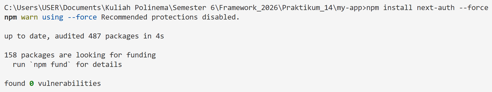
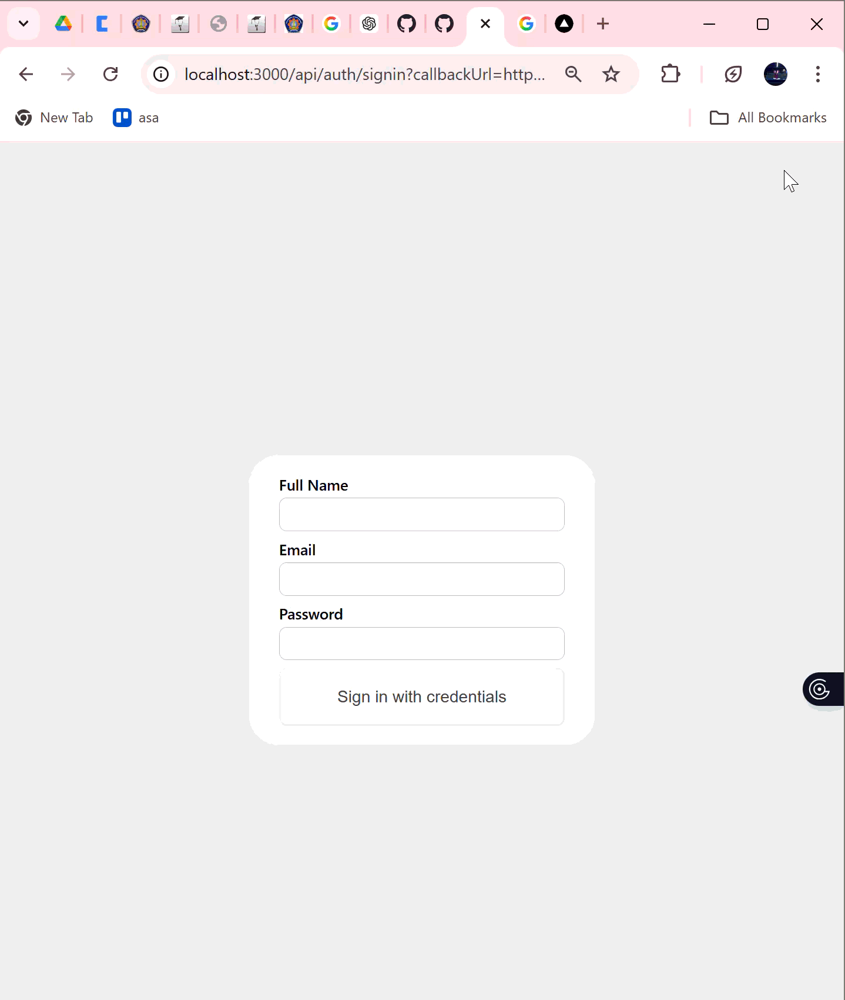
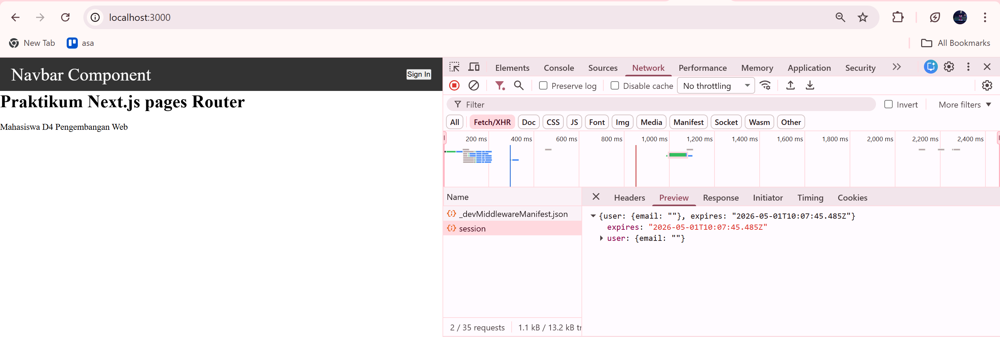
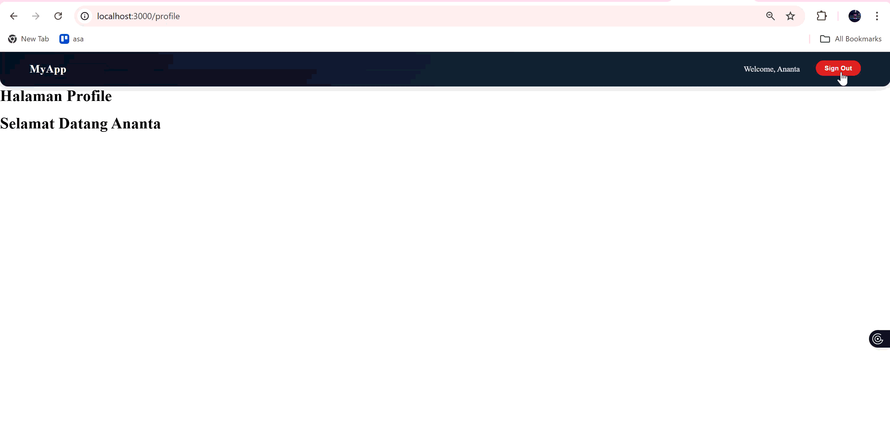

# LAPORAN PRAKTIKUM

* Mata Kuliah: Pemrograman Framework
* Topik: istem Autentikasi & Proteksi Route (NextAuth)

---

## LANGKAH PRAKTIKUM

### 1. Install NextAuth

Menginstall library NextAuth untuk kebutuhan autentikasi.

---

### 2. Konfigurasi API Auth

Membuat file `[...nextauth].ts` sebagai backend autentikasi.

---

### 3. Menambahkan Secret

Menambahkan `NEXTAUTH_SECRET` untuk keamanan JWT.

---

### 4. Session Provider

Digunakan agar frontend bisa mengakses session user.

---

### 5. Login & Logout

Menambahkan tombol login dan logout menggunakan NextAuth.

---

### 6. Menampilkan Session

Mengambil data session menggunakan `useSession()`.

---

### 7. Menambahkan Full Name

Menambahkan data tambahan (fullname) ke JWT dan session.

!

---

### 8. Halaman Profile

Menampilkan halaman profile yang berisi data user login.

---

### 9. Proteksi Route (Middleware)

Menggunakan middleware untuk membatasi akses halaman tertentu.

---

### 10. Pengujian

* Belum login → redirect

* Sudah login → bisa akses

* Logout → tidak bisa akses lagi 

---

## TUGAS PRAKTIKUM

### 1. Implementasi Credentials Provider

Login berhasil menggunakan email dan password.

### 2. Tambah Full Name

Field fullname ditambahkan pada proses login.

### 3. Menampilkan Full Name

Nama user berhasil ditampilkan di navbar dan profile.

### 4. Halaman Profile

Halaman profile berhasil dibuat dan menampilkan data user.

### 5. Proteksi Halaman

Halaman profile hanya bisa diakses saat login.

### 6. Dokumentasi

* Screenshot login 

* Screenshot session 

* Screenshot middleware 

---

## PERTANYAAN ANALISIS

 1. Mengapa session menggunakan JWT?

    **Jawab**:
Karena JWT bersifat **stateless**, sehingga tidak perlu menyimpan session di server dan lebih efisien untuk aplikasi modern.

 2. Perbedaan authorize() dan jwt()
    
    **Jawab**:
    * `authorize()` → validasi login user
    * `jwt()` → menyimpan data user ke dalam token

 3. Mengapa middleware perlu getToken()?

    **Jawab**:
Untuk **mengecek apakah user sudah login atau belum** sebelum mengakses halaman tertentu.

 4. Risiko jika NEXTAUTH_SECRET tidak digunakan?

    **Jawab**:
    * Token bisa dimanipulasi
    * Session tidak aman
    * Bisa menyebabkan error autentikasi

 5. Perbedaan autentikasi dan otorisasi

    **Jawab**:
    * Autentikasi → verifikasi identitas user
    * Otorisasi → menentukan hak akses user

---

##  KESIMPULAN

NextAuth mempermudah implementasi sistem login pada Next.js dengan:

* Credentials login
* Session berbasis JWT
* Middleware untuk proteksi halaman

Sehingga aplikasi menjadi **lebih aman dan terstruktur**.

---

