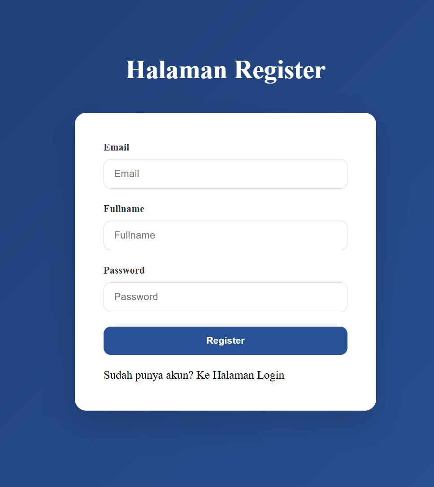
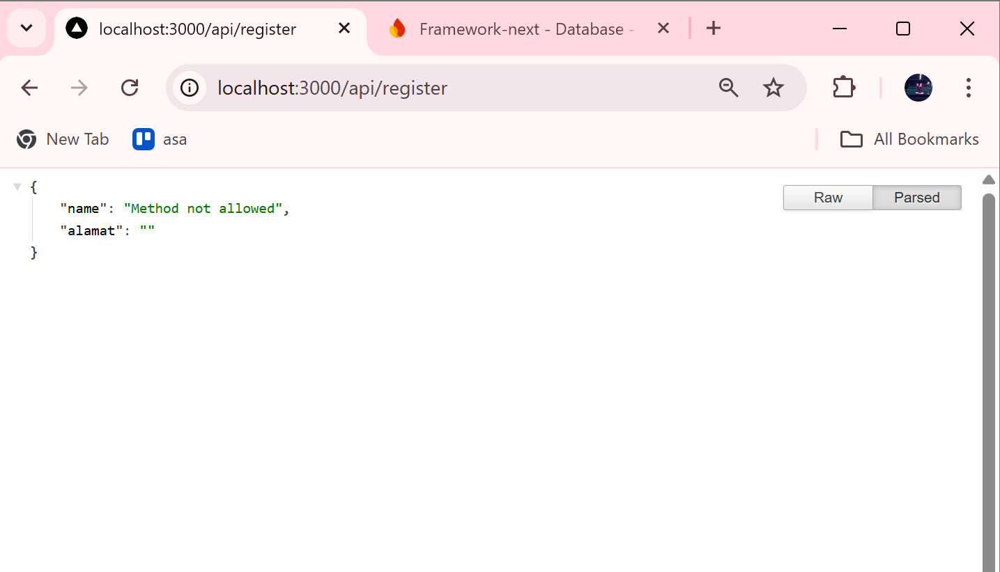
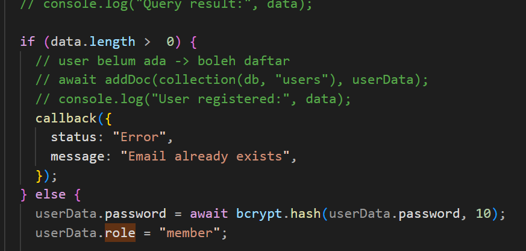
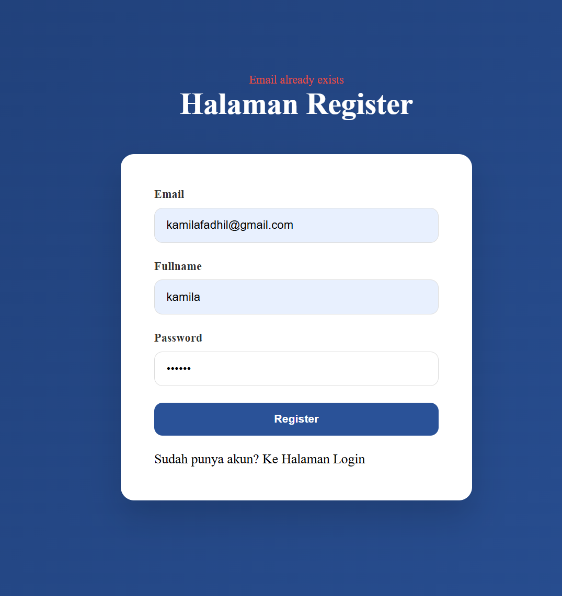

# LAPORAN PRAKTIKUM 

* Mata Kuliah: Pemrograman Framework
* Topik: Implementasi Sistem Registrasi (Database Integration)

---

## Bagian 1 – Membuat Register View

Pada tahap ini dibuat tampilan halaman register menggunakan React/Next.js.
Form berisi input:

* Email
* Full Name
* Password
* Button Register

Selain itu ditambahkan styling menggunakan `register.module.scss` agar tampilan lebih menarik dan user-friendly.

---

## Bagian 2 – Membuat API Register

Pada bagian ini dibuat API untuk menangani proses registrasi:

* Mengecek apakah email sudah ada di database
* Jika belum → data diproses
* Jika sudah → kirim error

Frontend akan mengirim request menggunakan method **POST** ke endpoint `/api/register`.

---

## Bagian 3 – Implementasi bcrypt

bcrypt digunakan untuk mengamankan password dengan cara hashing.
Langkah:

* Install bcrypt
* Hash password sebelum disimpan
* Simpan ke Firestore

Ditambahkan juga:

* Error handling (email sudah ada)
* Loading saat proses register

---

## 🔹 D. Pengujian Sistem

1. **Uji Register Baru**

   * Input: Email baru
   * Hasil: Data tersimpan & redirect ke login

2. **Uji Email Sudah Ada**

   * Input: Email sama
   * Hasil: Error 400 + pesan error

3. **Uji Method GET**

   * Akses API tanpa POST
   * Hasil: 405 Method Not Allowed

---

# E. Tugas Praktikum

### 1. Implementasi Register

Membuat sistem register yang terhubung ke Firebase Firestore.

---

### 2. Validasi Input

* Email wajib diisi

* Password minimal 6 karakter
  → Untuk memastikan data valid dan aman

  

---

### 3. Role Default

Setiap user otomatis memiliki role `"member"` saat registrasi.

---

### 4. Error Handling UI

Menampilkan pesan error di halaman

---

### 5. Screenshot Hasil

Menampilkan bukti:

* Register berhasil
* Email sudah ada
* Data di Firestore

---

# Jawaban Pertanyaan Analisis

1. Mengapa password harus di-hash?

   **Jawab**: Password di-hash agar tidak tersimpan dalam bentuk asli (plaintext), sehingga lebih aman jika database bocor.

 2. Perbedaan addDoc dan setDoc?

    **Jawab**:
      * addDoc → otomatis membuat ID baru
      * setDoc → menggunakan ID yang kita tentukan sendiri

3. Mengapa perlu validasi method POST?

   **Jawab**: Agar API hanya menerima request yang sesuai (POST), sehingga lebih aman dan tidak disalahgunakan.

4. Risiko jika email tidak dicek unik?

   **Jawab**:
   * User bisa duplicate
   * Data tidak valid
   * Potensi bug pada sistem login

5. Fungsi role pada user?

   **Jawab**: Untuk menentukan hak akses user, misalnya:

   * admin
   * member

