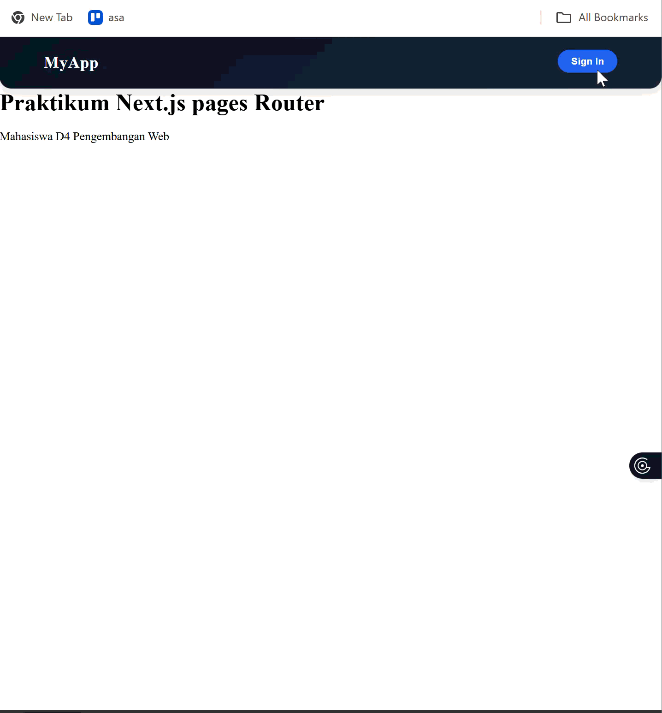
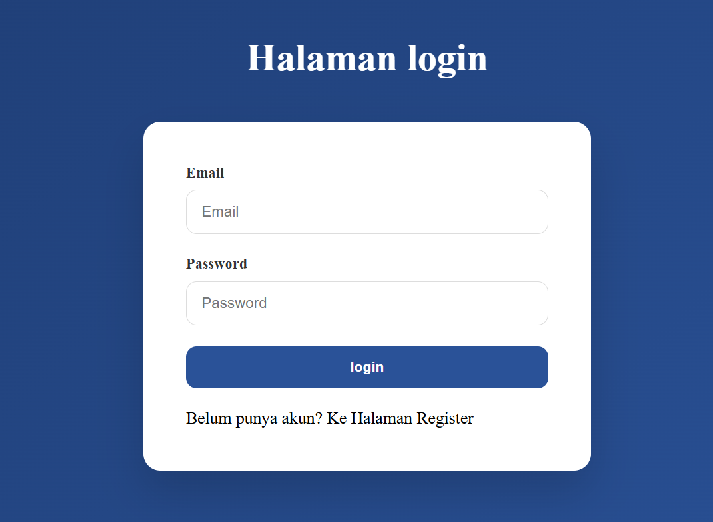
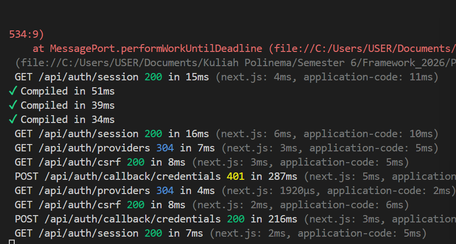
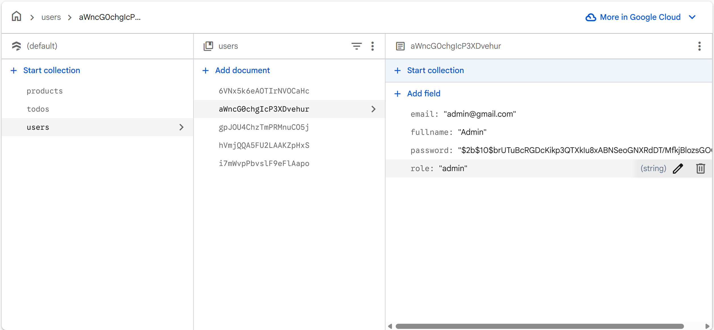
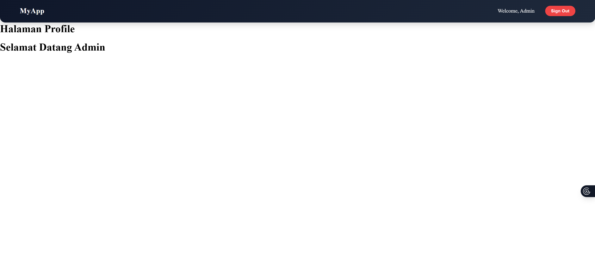
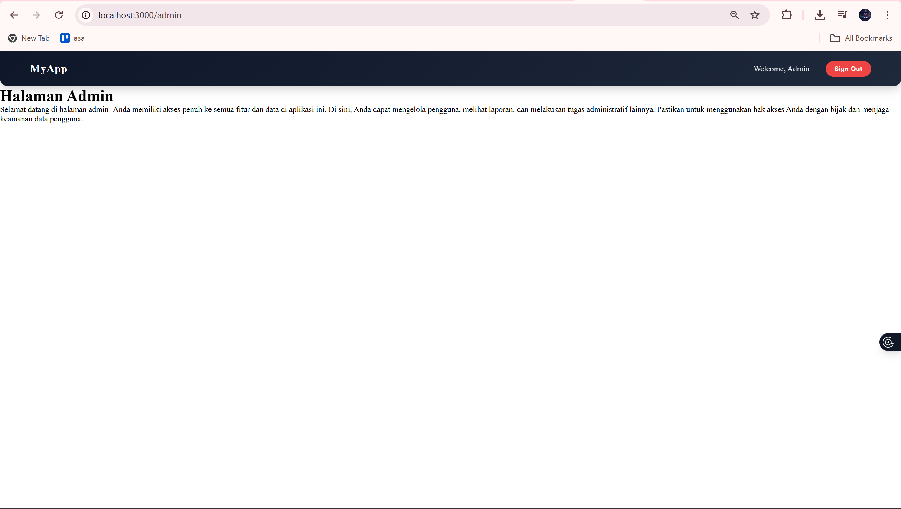

# LAPORAN PRAKTIKUM

**Implementasi Login Database & Multi-Role**

---

## BAGIAN 1 – Custom Login Page

Pada bagian ini dilakukan konfigurasi custom halaman login pada NextAuth dengan menambahkan properti `pages.signIn`. Tujuannya agar ketika user klik sign in, tidak menggunakan halaman default tetapi diarahkan ke halaman login buatan sendiri.

---

## BAGIAN 2 – Handle Login di Frontend

Pada tahap ini dibuat tampilan login dengan menyalin dari halaman register lalu disesuaikan. Input fullname dihapus karena tidak diperlukan saat login. Form login hanya menggunakan email dan password serta menghubungkan ke proses autentikasi.

---

## BAGIAN 3 – Authorize di NextAuth (Database Login)

Proses authorize digunakan untuk memvalidasi user dari database. Sistem akan mengambil data user berdasarkan email, lalu mencocokkan password menggunakan bcrypt. Jika valid, maka user diizinkan login dan session dibuat.

---

## BAGIAN 4 – Tambahkan Role ke Token

Pada bagian ini role user (admin/user) ditambahkan ke dalam token dan session. Hal ini penting agar sistem dapat mengenali hak akses user pada setiap halaman.

---

## BAGIAN 5 – Callback URL Logic

Callback URL digunakan untuk mengarahkan user kembali ke halaman sebelumnya setelah login. Middleware akan menangkap request dan mengatur redirect sesuai kondisi autentikasi.

---

## BAGIAN 6 – Halaman Admin & Authorization

**Member**

**Admin**

Dibuat halaman admin yang hanya bisa diakses oleh user dengan role admin. Middleware digunakan untuk membatasi akses sehingga user biasa tidak dapat membuka halaman admin.

---

#  TUGAS PRAKTIKUM

1. Menghubungkan sistem login dengan database agar data user tersimpan.

**Jawab :**

User hanya dapat login dengan email dan password yang sudah ada pada database

2. Menambahkan role (admin/user) untuk membedakan hak akses.

**Jawab :**

* Member/user

* Admin

3. Membuat halaman `/profile` dan `/admin`.

**Jawab :**

* `/profile`

* `/admin`

4. Membatasi akses halaman admin hanya untuk admin.

**Jawab**
**Member**

**Admin**

5. Mengatur callback URL agar redirect berjalan otomatis.

**Jawab**

---

#  PERTANYAAN ANALISIS

### 1. Mengapa password harus diverifikasi dengan bcrypt.compare?

**Jawaban:**
Karena password disimpan dalam bentuk hash, sehingga tidak bisa dibandingkan langsung. bcrypt.compare digunakan untuk mencocokkan password input dengan hash secara aman.

### 2. Mengapa role disimpan di token?

**Jawaban:**
Agar sistem dapat mengetahui hak akses user tanpa harus query database berulang kali, sehingga lebih cepat dan efisien.

### 3. Apa fungsi callbackUrl?

**Jawaban:**
Untuk mengarahkan user kembali ke halaman sebelumnya setelah login, sehingga pengalaman pengguna lebih baik.

### 4. Mengapa middleware penting untuk security?

**Jawaban:**
Middleware berfungsi sebagai penjaga akses halaman, memastikan hanya user yang memiliki izin yang bisa masuk ke halaman tertentu.

### 5. Apa risiko jika role tidak dicek di middleware?

**Jawaban:**
User biasa bisa mengakses halaman admin, yang dapat menyebabkan kebocoran data atau penyalahgunaan sistem.

