# **LAPORAN PRAKTIKUM**

**Implementasi Login Google Provider dengan NextAuth.js + Firebase**
---

# **A. Persiapan**

### **Langkah-langkah:**

1. Menyiapkan project Next.js
2. Menginstall NextAuth.js
3. Menghubungkan Firebase Firestore
4. (Opsional) Menyiapkan login credential

---

# **B. Konfigurasi Google OAuth**

1. Masuk ke Google Cloud Console
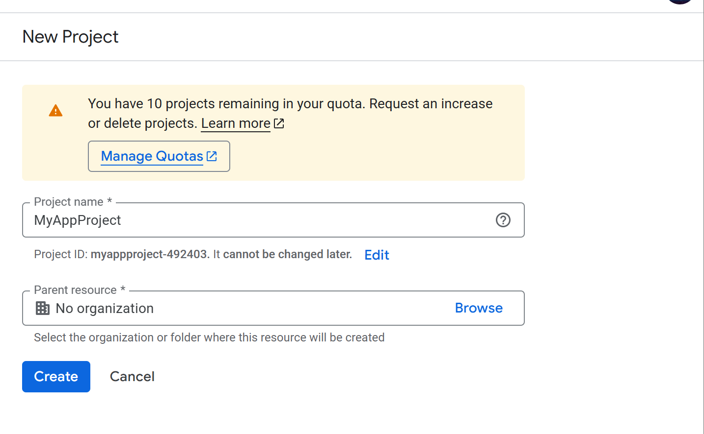

2. Membuat project baru
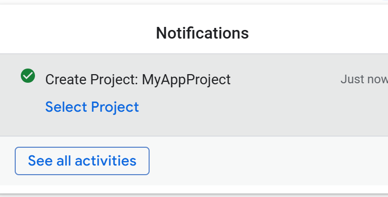

3. Mengatur OAuth Consent Screen
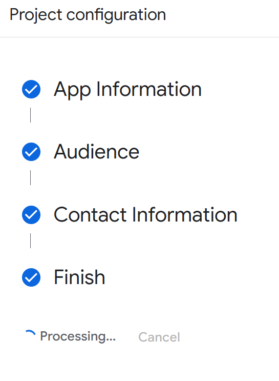

4. Membuat OAuth Client ID
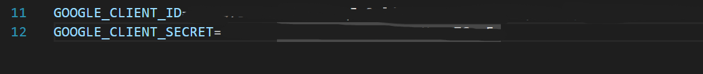

Tahap ini digunakan untuk mendapatkan **Client ID dan Client Secret** sebagai identitas aplikasi saat menggunakan login Google.

---

# **C. Environment Variables**

1. Copy Client ID & Client Secret
2. Simpan ke file `.env`

---

# **D. Konfigurasi NextAuth + Google Provider**

1. Buka file `[...nextauth].ts`
2. Tambahkan Google Provider
3. Atur callback JWT dan session

Google Provider digunakan untuk autentikasi, sedangkan callback JWT & session digunakan untuk mengatur data user selama login.

---

# **E. Tampilan Login Google**

### **Langkah-langkah:**

1. Tambahkan tombol login Google
2. Jalankan aplikasi
3. Login menggunakan akun Google

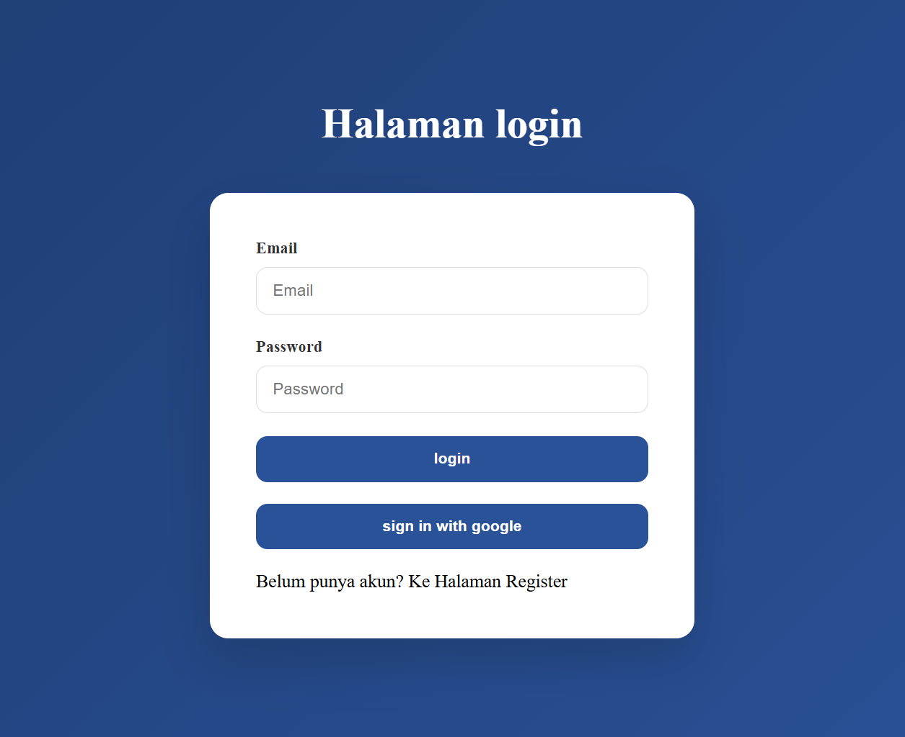

User dapat login menggunakan akun Google melalui tombol “Sign in with Google”.

---

# **F. Menampilkan Data User (Avatar)**

### **Langkah-langkah:**

1. Ambil data session
2. Tampilkan nama dan gambar user

Data seperti nama dan foto profil ditampilkan untuk meningkatkan pengalaman pengguna.

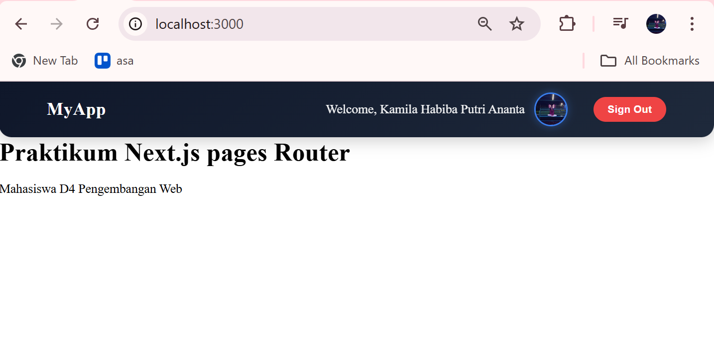

---

# **G. Simpan Data ke Firebase**

### **Langkah-langkah:**

1. Tambahkan fungsi di `servicefirebase.ts`
2. Cek apakah user sudah ada
3. Insert / update data ke Firestore
4. Panggil service di JWT callback

Data user disimpan agar dapat digunakan untuk manajemen sistem seperti role dan histori login.

---

# **H. Pengujian**

### **Skenario:**

* Login pertama → data tersimpan

* Login kedua → data diupdate

* Role member → redirect

* Role admin → akses

* Avatar tampil

---

# **ANALISIS & DISKUSI**

### **1. Perbedaan login credential dan login Google**

* Credential: input email & password manual
* Google: menggunakan akun pihak ketiga (OAuth)

### **2. Mengapa data Google disimpan ke database?**

Agar sistem dapat mengelola user (role, akses, histori) secara mandiri.

### **3. Fungsi JWT callback**

Untuk menyimpan dan memodifikasi data user ke dalam token saat login.

### **4. Mengapa perlu multi-role?**

Untuk membedakan hak akses user (admin, member, dll).

### **5. Risiko jika tidak menyimpan user**

* Tidak bisa mengatur role
* Tidak ada kontrol data user
* Sulit tracking aktivitas

---

# **TUGAS MANDIRI**

## **1. Tambahkan Role Editor**
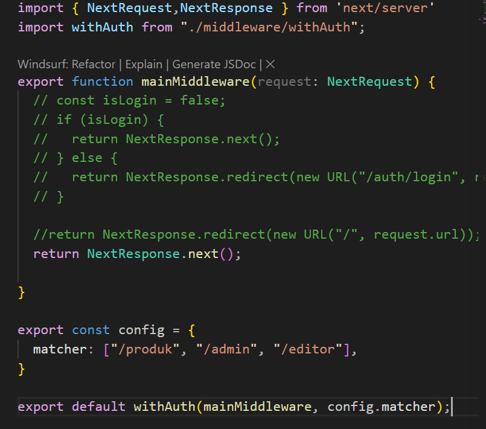
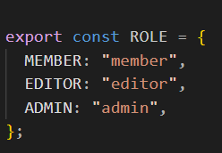

Menambahkan role baru “editor” untuk akses tertentu dalam sistem.

---

## **2. Halaman Khusus Editor**
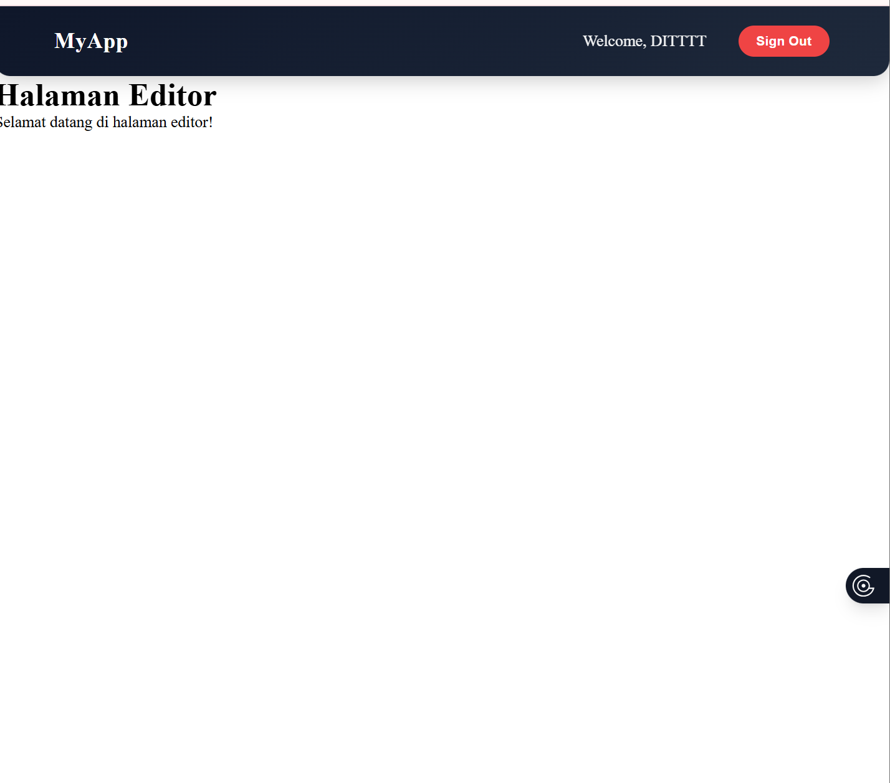

Membuat halaman yang hanya bisa diakses oleh user dengan role editor.

---

## **3. Tambahkan Provider GitHub**
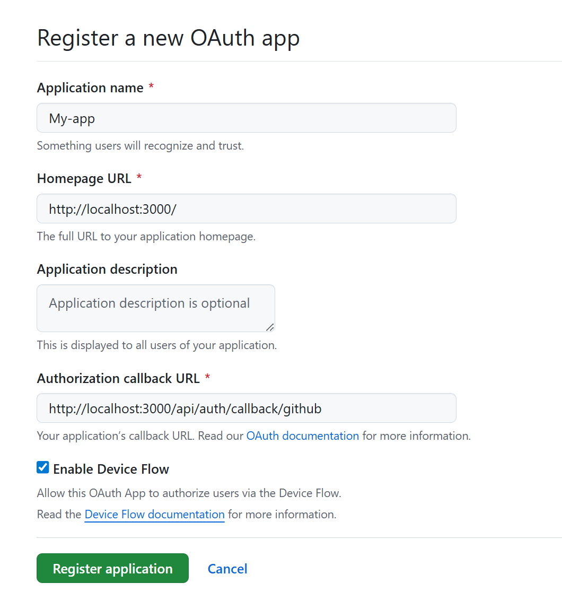
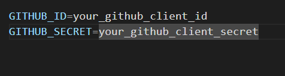

Menambahkan login menggunakan GitHub sebagai alternatif selain Google.

---

## **4. Refactor Service**

Merapikan kode service agar reusable dan mudah digunakan kembali.

---

## **5. Optimasi Avatar dengan next/image**

Menggunakan `next/image` untuk performa loading gambar yang lebih baik.

---

# **KESIMPULAN**

Praktikum ini berhasil:

* Mengimplementasikan Google OAuth
* Mengintegrasikan NextAuth.js
* Menyimpan user ke Firebase
* Menggunakan JWT & session
* Menerapkan multi-role
