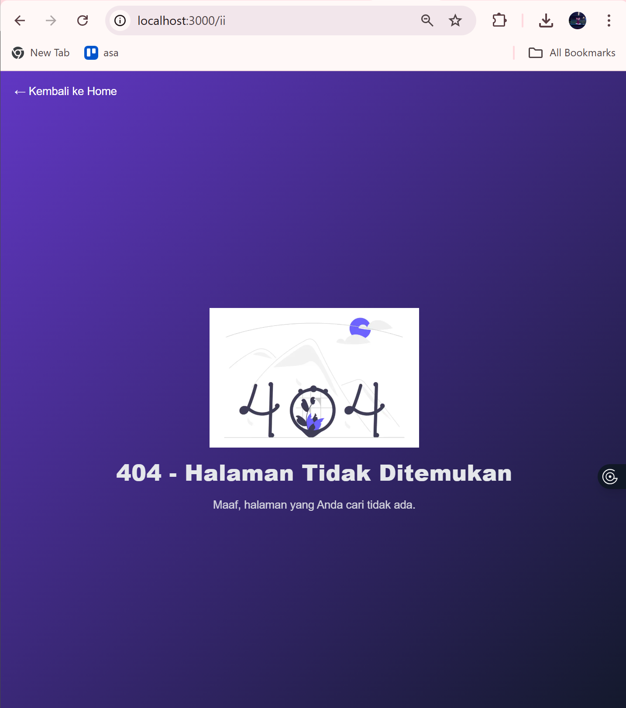
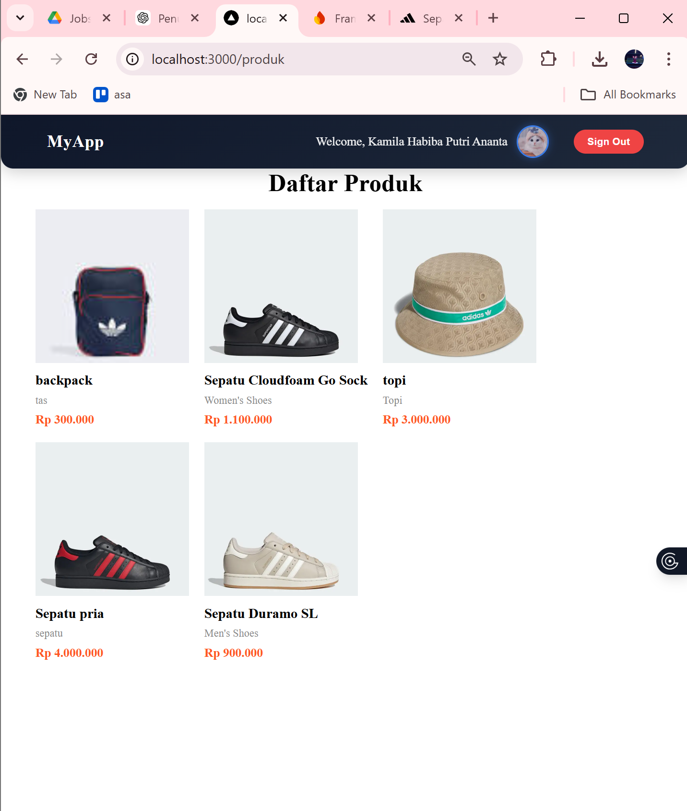
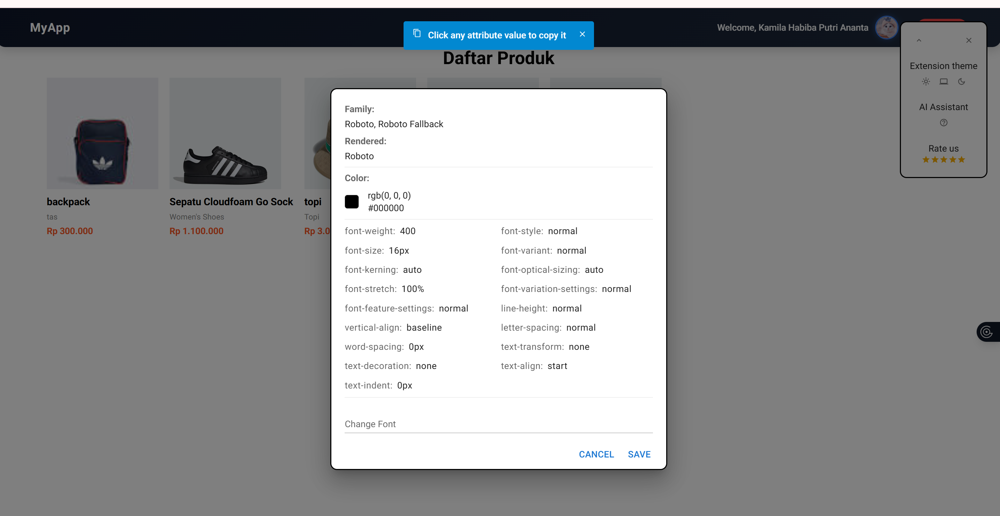
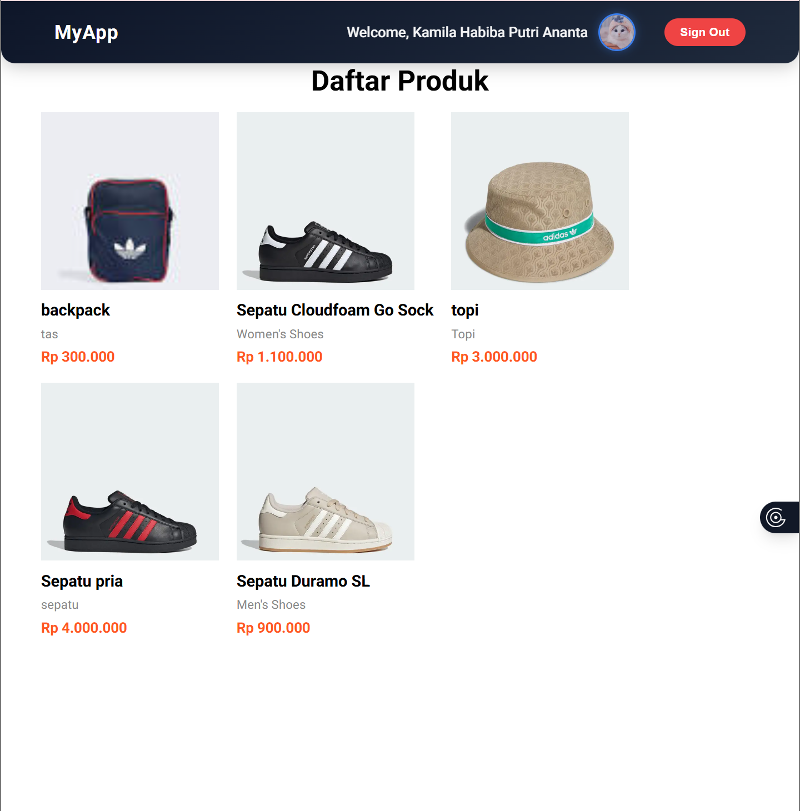
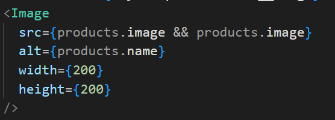
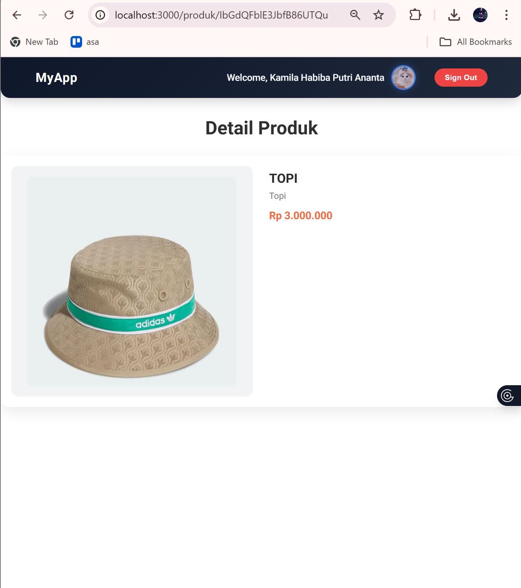
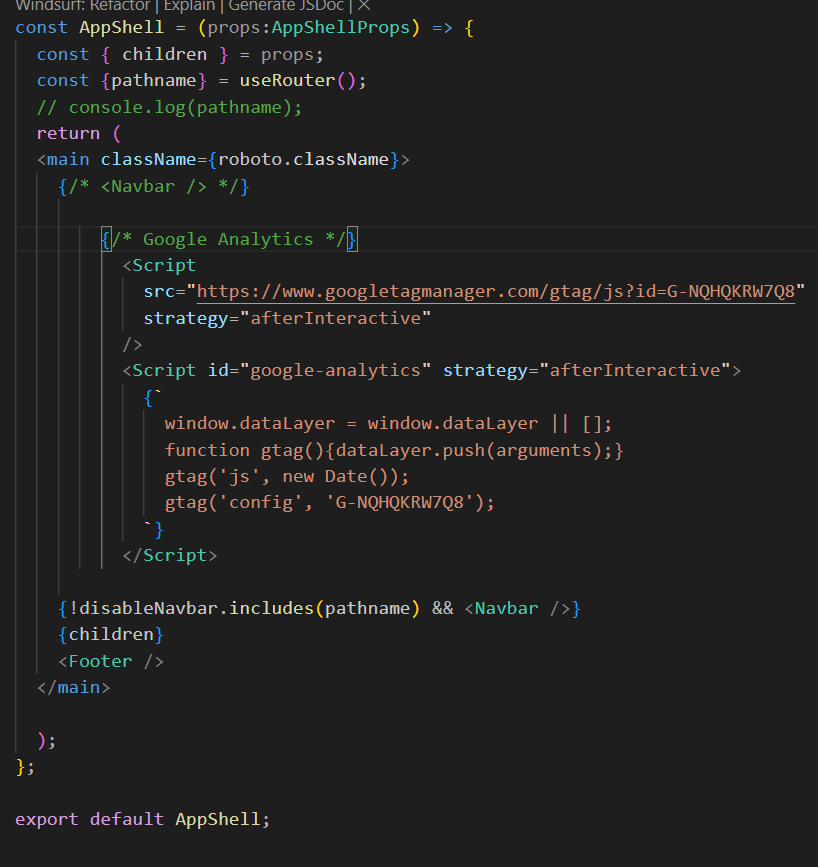
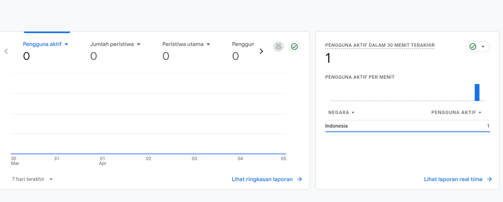
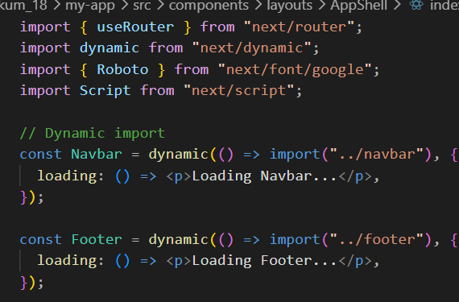
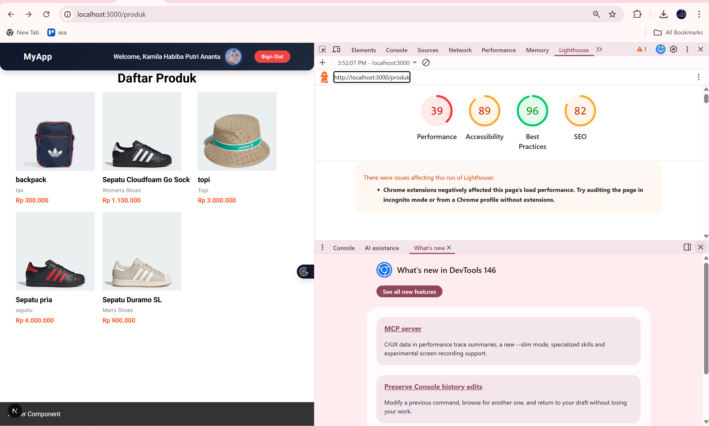

# LAPORAN PRAKTIKUM

**Mata Kuliah:** Pemrograman Framework
**Topik:** Optimasi Performa Aplikasi Menggunakan Next.js

---

# PRAKTIKUM 1 – Image Optimization

## A. Optimasi Gambar Lokal

### Langkah:

* Membuka file `src/pages/404.tsx`
* Mengganti tag `` menjadi `<Image>` dari Next.js
* Menambahkan atribut `width` dan `height`

Penggunaan `next/image` membuat gambar lebih optimal karena otomatis melakukan kompresi dan lazy loading.

---

## B. Optimasi Gambar Remote

### Langkah:

* Membuka file `views/product/index.tsx`
* Mengganti `` dengan `<Image>`
* Menambahkan konfigurasi di `next.config.js`

Gambar dari URL eksternal harus didaftarkan di `next.config.js` agar bisa dioptimasi oleh Next.js. 

---

#  PRAKTIKUM 2 – Font Optimization

### Langkah:

* Membuka file `Appshell/index.tsx`
* Import font dari `next/font/google`
* Menggunakan font pada elemen utama

Font dimuat langsung oleh Next.js tanpa CDN sehingga lebih cepat dan tidak menyebabkan render blocking. 

---

# PRAKTIKUM 3 – Script Optimization

### Langkah:

* Membuka file `layouts/Navbar/index.tsx`
* Menambahkan `<Script>` dari Next.js
* Menggunakan strategy `lazyOnload`

Script dijalankan setelah halaman selesai dimuat sehingga tidak menghambat loading awal. 

---

# PRAKTIKUM 4 – Optimasi Avatar

### Langkah:

* Mengganti `` avatar menjadi `<Image>`
* Menambahkan domain Google pada `next.config.js`

Avatar dari Google perlu dikonfigurasi agar bisa di-load dan dioptimasi oleh Next.js.

---

# TUGAS PRAKTIKUM

### 1. Optimasi semua image

Menggunakan `next/image` agar lebih hemat bandwidth dan otomatis lazy loading.

### 2. Menggunakan font

Menggunakan minimal 1 font dari `next/font` untuk performa lebih baik.

### 3. Menambahkan Google Analytics

Menggunakan `next/script` agar script tidak blocking.

### 4. Dynamic Import

Menggunakan `dynamic import` untuk lazy loading komponen.

### 5. Dokumentasi performa

Menggunakan Lighthouse untuk melihat peningkatan performa.

---

# REFLEKSI & DISKUSI

### 1. Mengapa `` biasa tidak optimal?

Karena tidak memiliki optimasi otomatis seperti lazy loading dan kompresi gambar.

### 2. Perbedaan font CDN dan next/font?

* CDN: load dari server luar, bisa blocking
* next/font: dioptimasi langsung oleh Next.js, lebih cepat

### 3. Mengapa script bisa membuat website lambat?

Karena script dapat blocking rendering jika dimuat di awal.

### 4. Kapan menggunakan dynamic import?

Saat komponen tidak perlu dimuat di awal (lazy loading).

### 5. Dampak bundle size terhadap UX?

Semakin besar bundle size, semakin lama loading sehingga UX menurun.
