# LAPORAN PRAKTIKUM

**Mata Kuliah:** Pemrograman Framework
**Topik:** Unit Testing Next.js dengan Jest

---

# PRAKTIKUM PER BAGIAN

## Praktikum 1 – Setup Jest

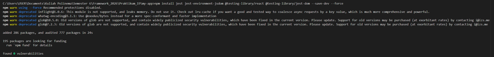

**Langkah:**
* Install dependency Jest & Testing Library
* Buat file `jest.config.mjs`
* Tambahkan script `test` & `test:coverage` di `package.json`

Tahap awal untuk menyiapkan environment testing pada Next.js agar bisa menjalankan unit test.

---

## Praktikum 2 – Struktur Folder Testing

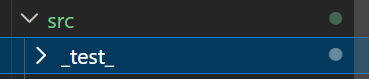

**Langkah:**

* Buat folder `src/__test__/`
* Pisahkan testing berdasarkan pages/components

Struktur ini memudahkan pengelolaan file testing agar rapi dan terorganisir.

---

## Praktikum 3 – Testing Halaman About

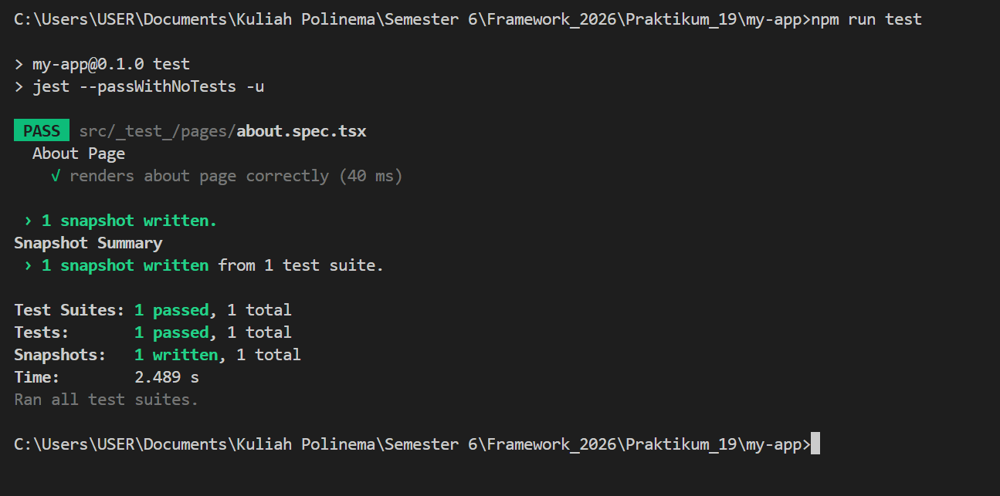

**Langkah:**

* Buat file `about.spec.tsx`
* Gunakan snapshot test
* Jalankan `npm run test`

Snapshot digunakan untuk membandingkan tampilan komponen agar tidak berubah tanpa disadari.

---

## Praktikum 4 – Coverage Report

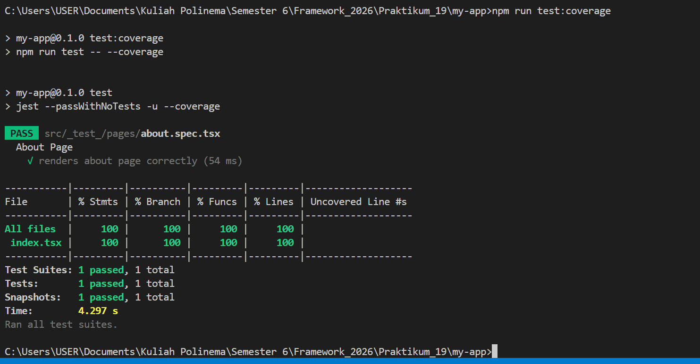
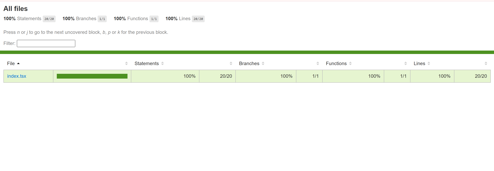

**Langkah:**

* Jalankan `npm run test:coverage`
* Buka folder `coverage/lcov-report/index.html`

Coverage menunjukkan seberapa banyak kode yang sudah diuji 

---

## Praktikum 5 – Konfigurasi Coverage

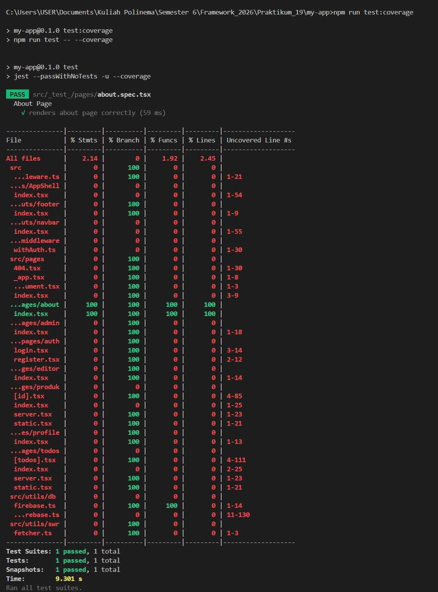
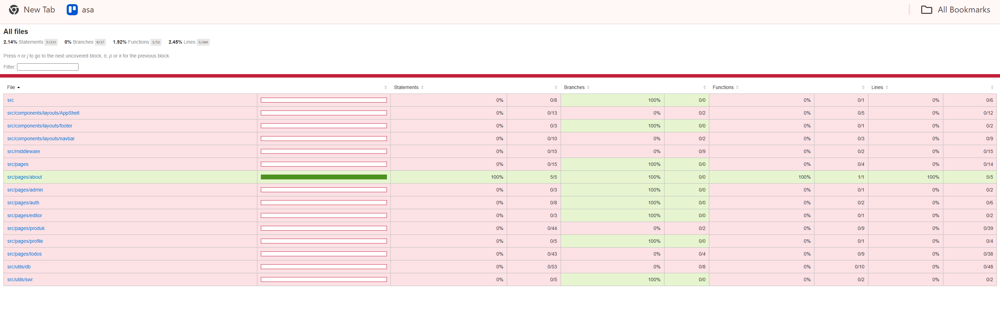

**Langkah:**

* Update `jest.config.mjs`
* Atur file yang dihitung dalam coverage

Digunakan untuk mengatur file mana saja yang dihitung dalam pengujian coverage.

---

## Praktikum 6 – Testing dengan getByTestId

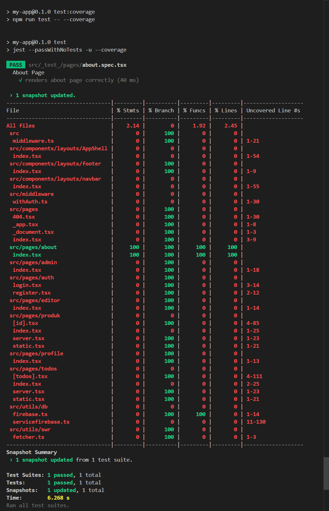

**Langkah:**

* Tambahkan `data-testid` di komponen
* Gunakan `getByTestId()` pada testing

Digunakan untuk mengambil elemen tertentu saat testing.

---

## Praktikum 7 – Mocking Router

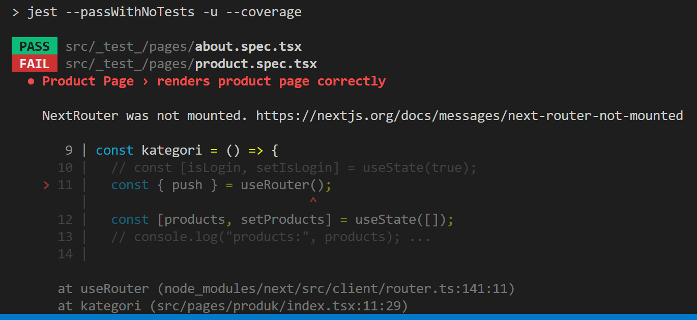

**Langkah:**

* Buat file test halaman produk
* Mock `next/router`

Mocking diperlukan agar testing tidak error saat menggunakan router Next.js.

---

## Praktikum 8 – Handling Undefined Data

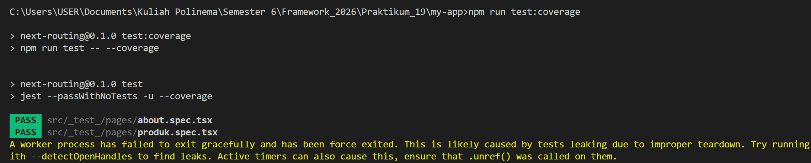
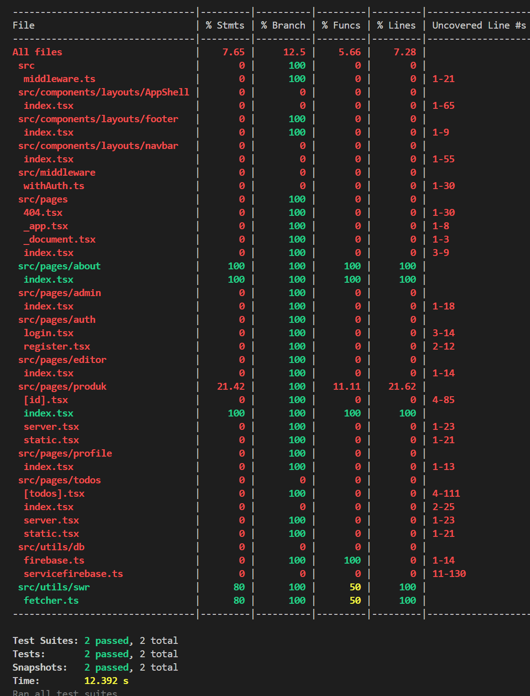

**Langkah:**

* Jalankan testing
* Perbaiki error undefined pada komponen

Digunakan untuk mencegah error saat data belum tersedia.

---

# TUGAS PRAKTIKUM

1. Buat unit test untuk:

   * Halaman Product
   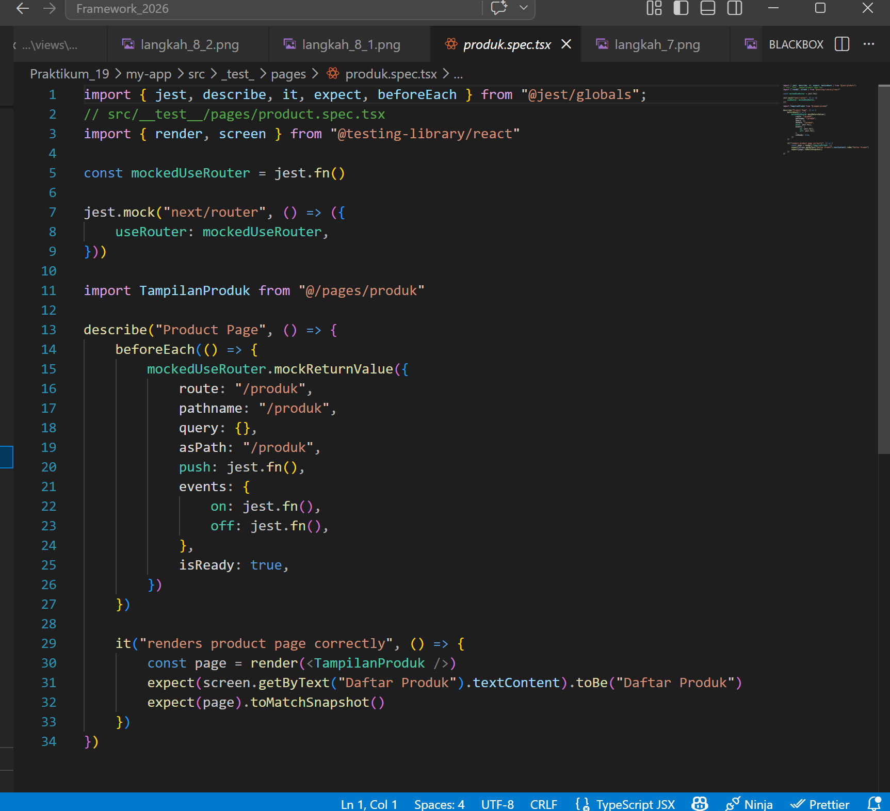

   * 1 Komponen
   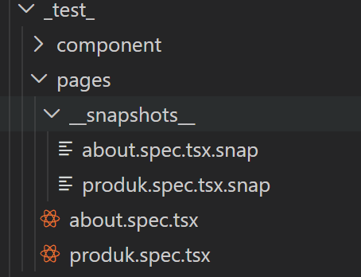

2. Gunakan:

   * Snapshot test
   * `toBe()`
   * `getByTestId()`
   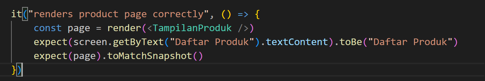

3. Coverage minimal 50%
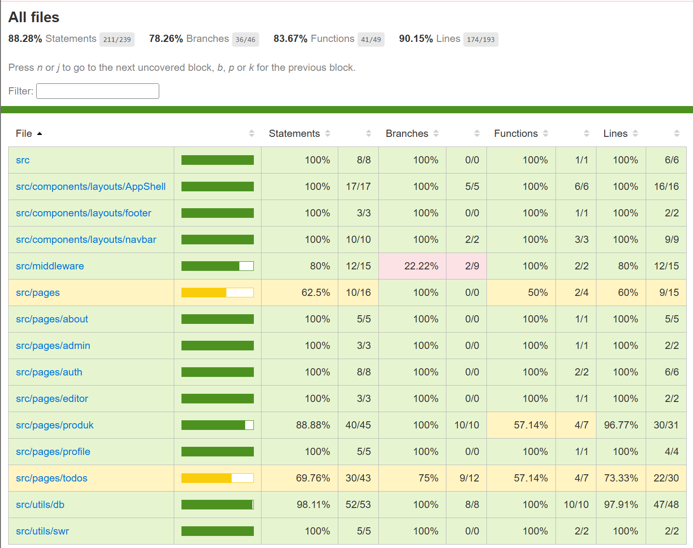

4. Gunakan mocking router

   Saya sudah melakukan mocking router pada praktikum

5. Dokumentasikan hasil

---

# DISKUSI

1. **Mengapa unit testing penting?**
   Untuk memastikan kode bebas bug sebelum production.

2. **Mengapa branch coverage sulit?**
   Karena harus menguji semua kemungkinan kondisi (if/else).

3. **Apa itu mocking?**
   Teknik meniru fungsi/library agar testing tetap berjalan.

4. **Kapan snapshot digunakan?**
   Saat ingin mengecek perubahan tampilan UI.

5. **Apakah semua file harus dites?**
   Tidak, fokus pada bagian penting (critical feature).

---

