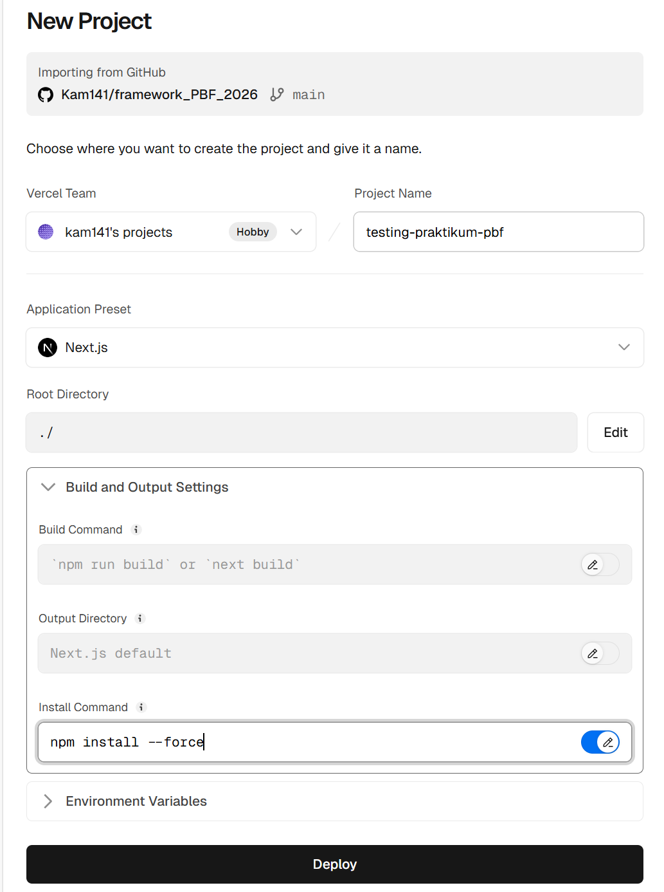
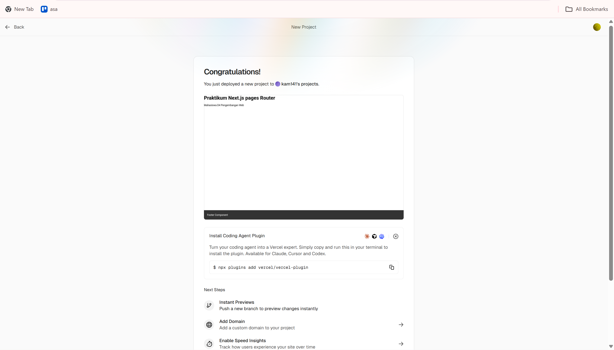
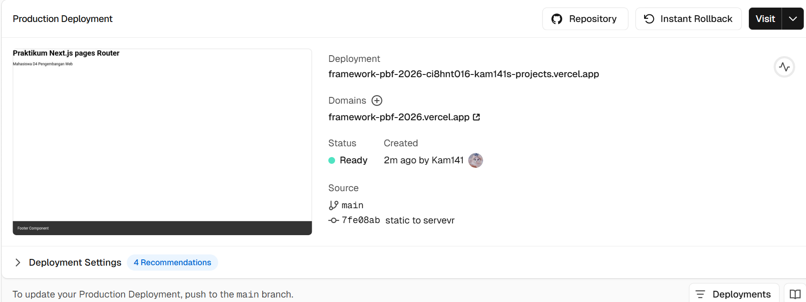
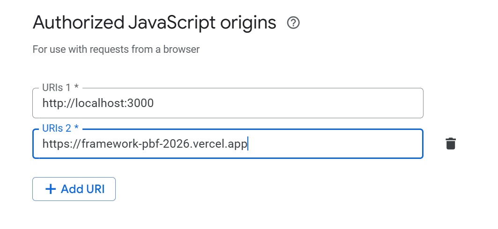
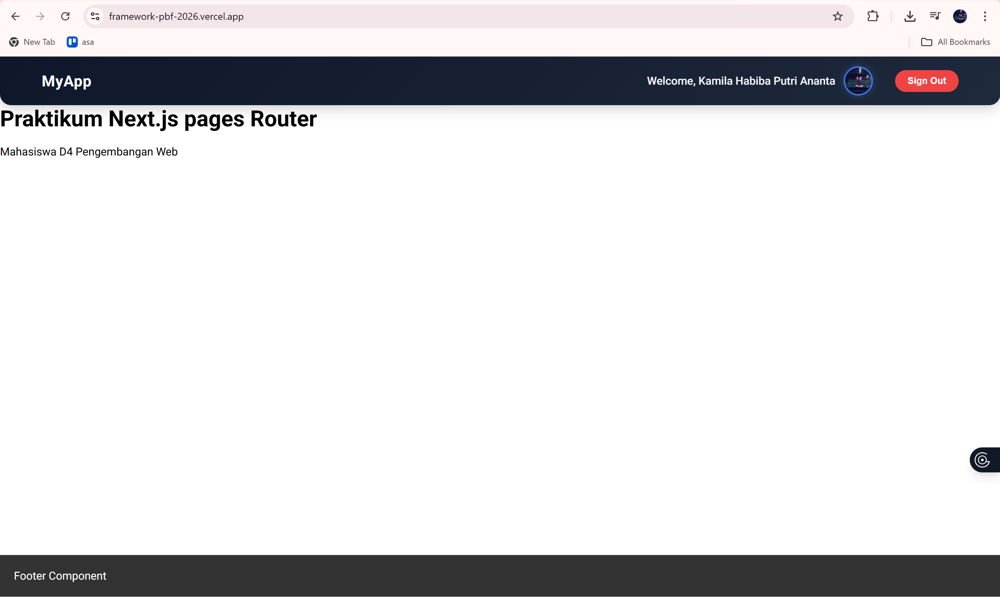
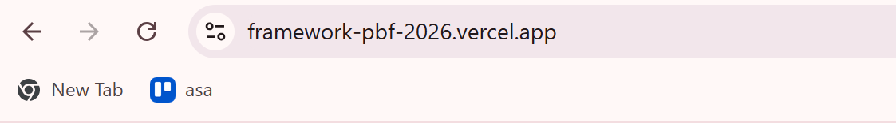
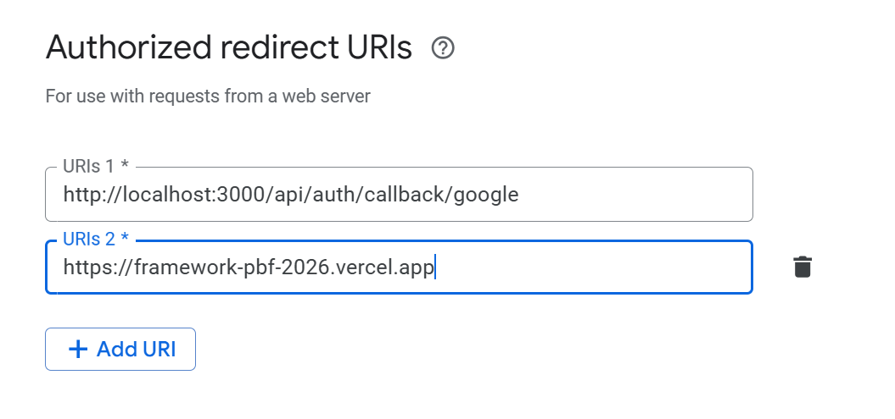
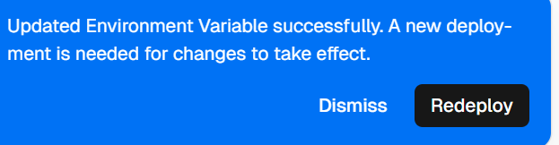
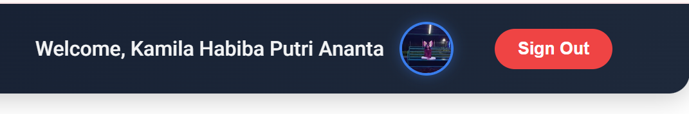

# LAPORAN PRAKTIKUM

**Mata Kuliah:** Pemrograman Framework
**Topik:** Deployment Next.js ke Vercel

---

# PRAKTIKUM PER BAGIAN

## Praktikum 1 – Membuat Repository GitHub

**Langkah:**

* Buat repository di GitHub
* Hubungkan project lokal dengan Git
* Push project ke GitHub

Digunakan untuk menyimpan project secara online dan sebagai sumber deployment.

---

## Praktikum 2 – Deployment ke Vercel

**Langkah:**

* Login ke Vercel
* Import project dari GitHub
* Klik deploy

---

## Praktikum 3 – Mengatasi Error Deployment (SSG → SSR)

**Langkah:**

* Hapus file static (SSG)
* Gunakan SSR (`getServerSideProps`)
* Gunakan environment variable

Error terjadi karena data API masih localhost dan tidak bisa diakses saat build.

---

## Praktikum 4 – Environment Variable di Vercel

**Langkah:**

* Buka settings project di Vercel
* Tambahkan `NEXT_PUBLIC_API_URL`
* Sesuaikan dengan URL Vercel

Digunakan untuk mengganti URL localhost menjadi URL production.

---

## Praktikum 5 – Konfigurasi Google OAuth

**Langkah:**

* Masuk Google Cloud Console
* Tambahkan Authorized Origin
* Tambahkan Redirect URI

---

## Praktikum 6 – Pengujian Setelah Deployment

**Langkah:**

* Akses halaman `/`, `/about`, `/product`
* Coba login Google
* Pastikan API dan database berjalan

Digunakan untuk memastikan aplikasi berjalan dengan baik setelah deploy.

---

# TUGAS PRAKTIKUM

1. Deploy project ke Vercel

2. Pastikan API tidak menggunakan localhost

3. Konfigurasi Google OAuth

4. Lakukan minimal 1 redeploy

5. Dokumentasikan:

   * Dashboard Vercel
   
   * URL hasil deploy

    

   * Login Google berhasil
   

---

# DISKUSI

1. **Mengapa localhost tidak boleh digunakan?**
   Karena hanya bisa diakses di komputer sendiri, tidak di server production.

2. **Mengapa SSG bisa gagal?**
   Karena data tidak tersedia saat proses build.

3. **Perbedaan SSR dan SSG?**

   * SSR: data diambil saat request
   * SSG: data diambil saat build

4. **Mengapa perlu redeploy?**
   Agar perubahan environment terbaca oleh server.

5. **Fungsi Redirect URI?**
   Untuk mengarahkan kembali user setelah login OAuth.

