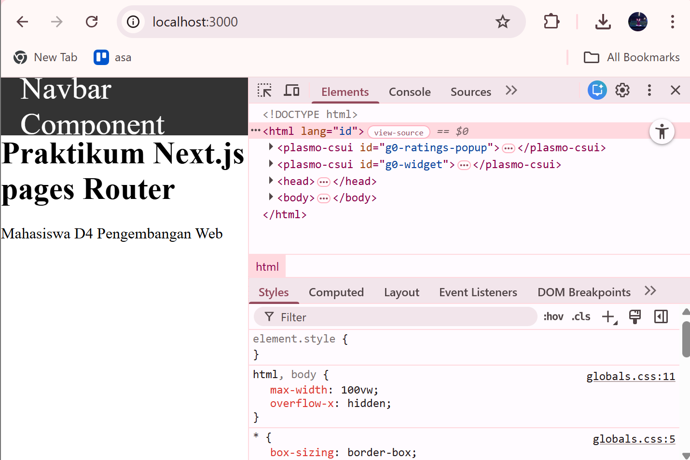
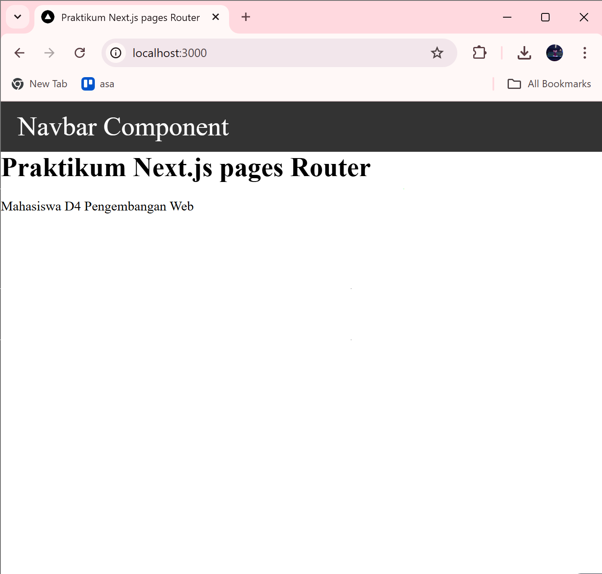
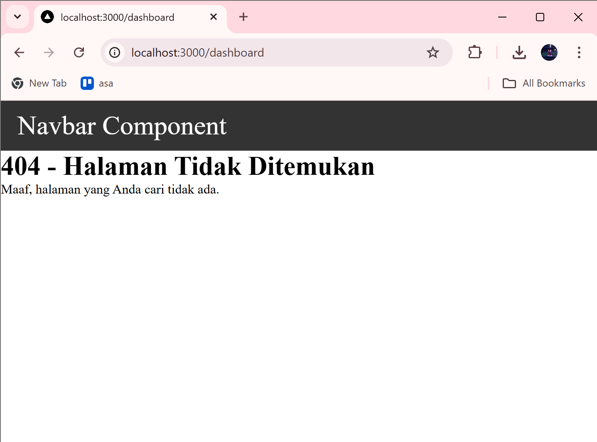
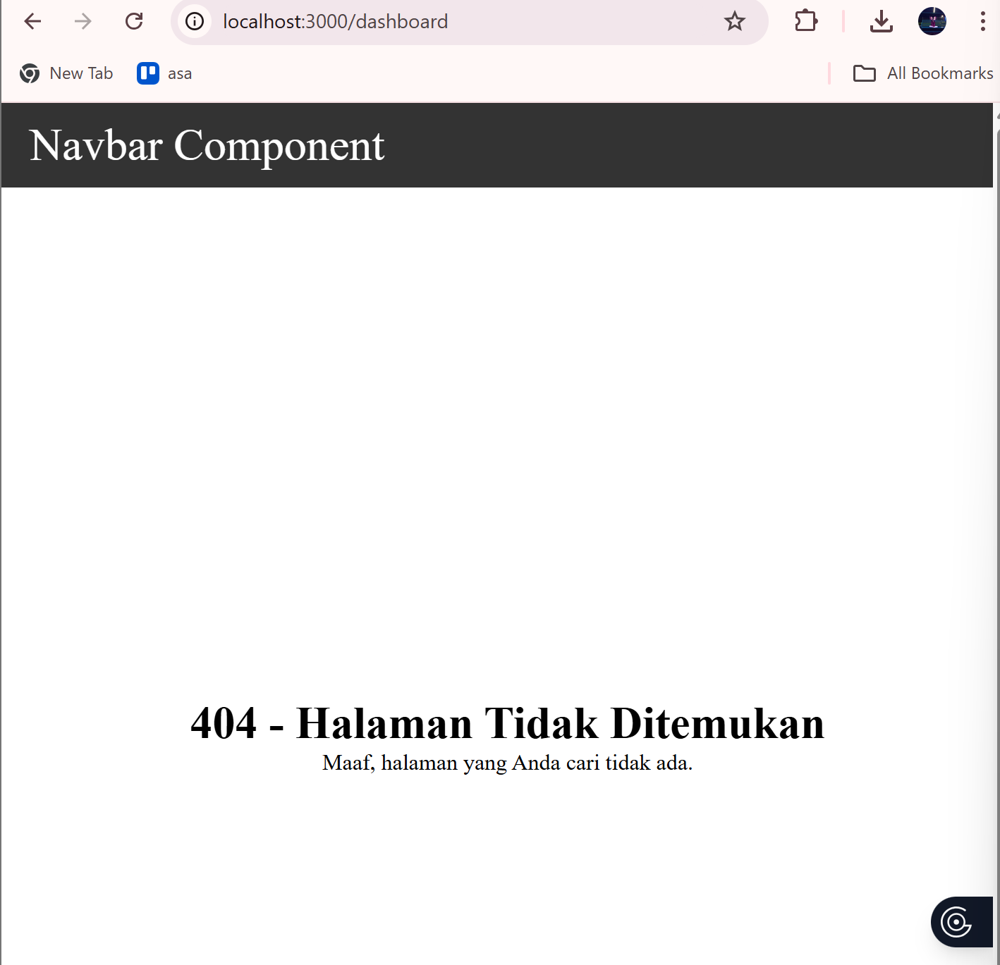
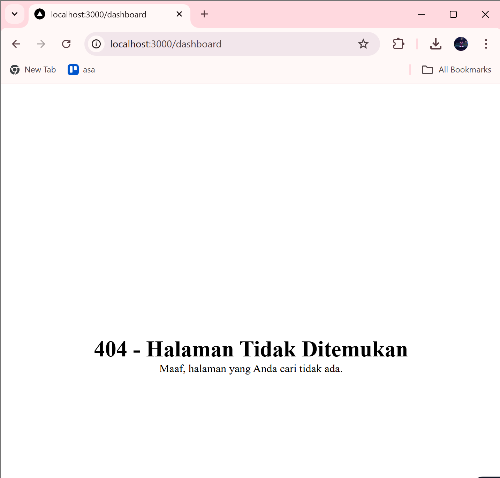
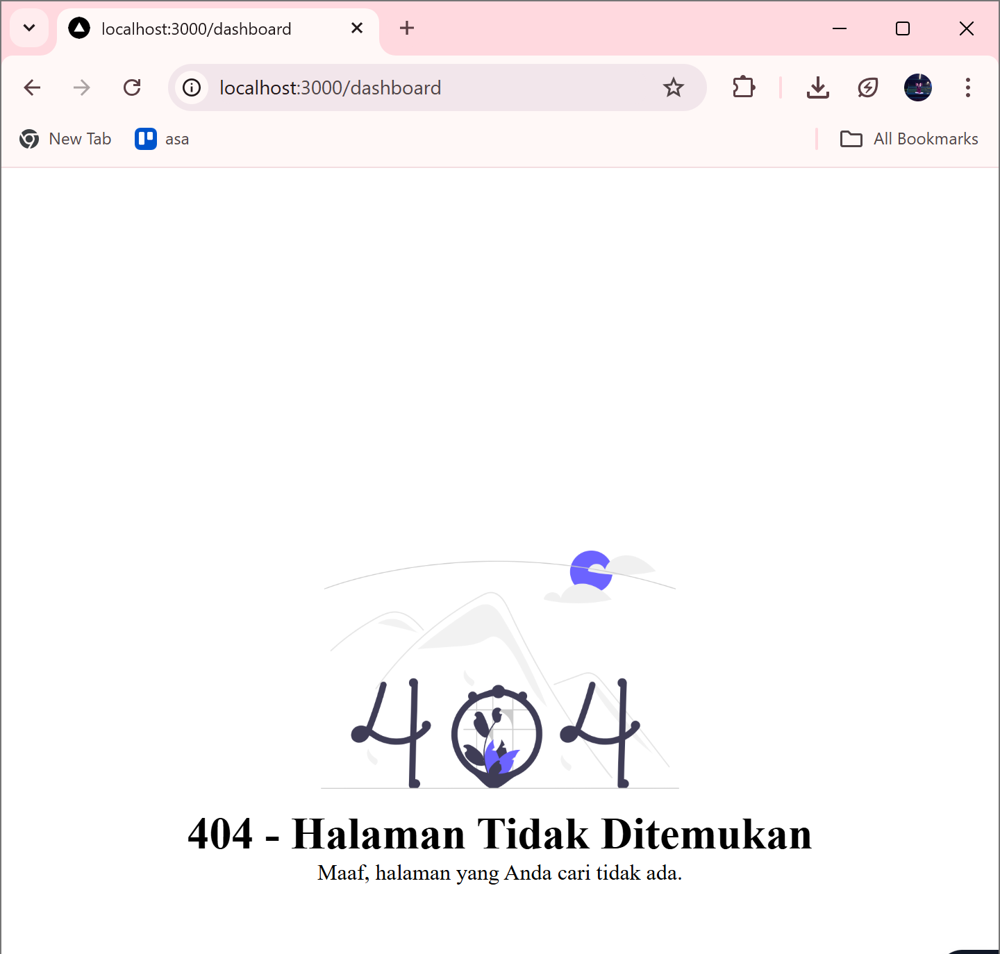
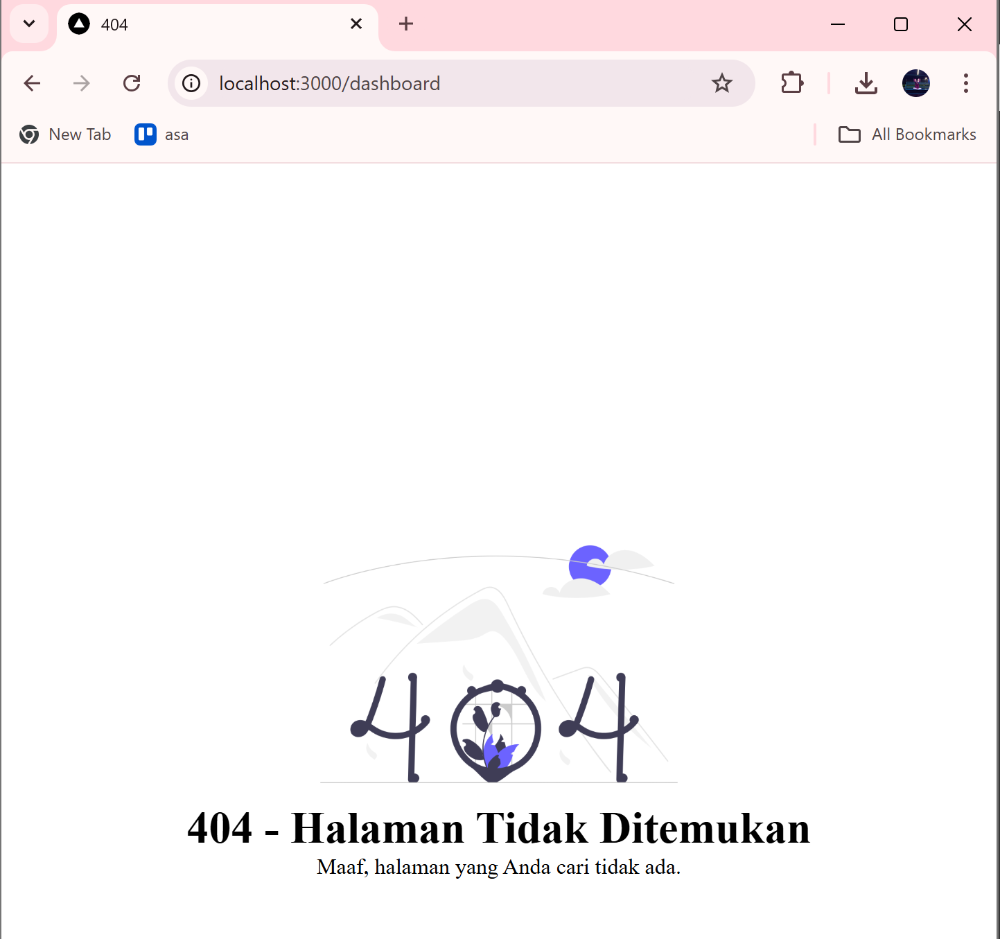
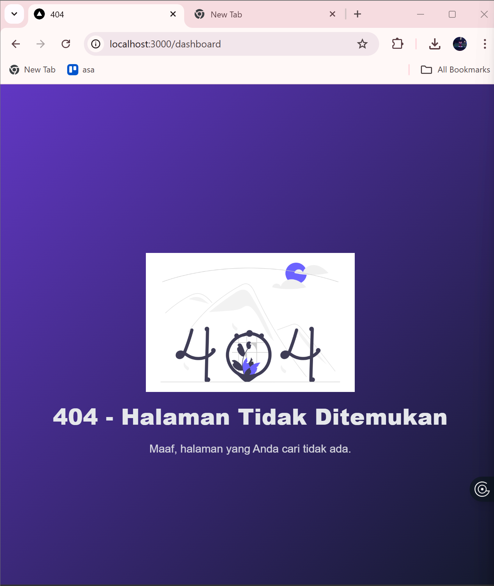

# Laporan Praktikum  
## Custom Document & Custom Error Page pada Next.js

---

## 2. Custom Document (_document.js)

Mengubah struktur HTML global dan menambahkan atribut `lang="id"`.

---

## 3. Pengaturan Title per Halaman

Menambahkan `<Head>` pada `index.js` untuk mengatur title tab browser.

---

## 4. Membuat File 404

Membuat `pages/404.tsx` sebagai halaman error kustom.

Halaman otomatis tampil saat route tidak ditemukan.

## 5. Styling Halaman 404

Menggunakan `404.module.scss` untuk mengatur layout ke tengah.

### Melakukan Handling Navbar

Menonaktifkan Navbar pada route `/404`.

---

## 6. Menampilkan Gambar dari Folder Public

Menambahkan gambar dari folder `public/` menggunakan tag ``.

---

# Tugas Praktikum

## Tugas 1 (Wajib)

Menambahkan pada halaman 404:
- Judul halaman
- Deskripsi singkat
- Gambar ilustrasi

Halaman 404 harus memiliki tampilan yang informatif dan menarik.

---

## Tugas 2 (Wajib)

Melakukan kustomisasi pada halaman 404:
- Mengubah warna
- Mengubah font
- Mengatur ulang layout
- Navbar tidak tampil di halaman 404

Tampilan dibuat lebih modern dan berbeda dari default.

---

## Tugas 3 (Pengayaan)

Menambahkan tombol:
- **"Kembali ke Home"**

Menggunakan navigasi Next.js (`Link`) agar pengguna dapat kembali ke halaman utama.

# Pertanyaan Evaluasi  
### 1. Apa fungsi utama `_document.js`?

Fungsi utama `_document.js` adalah untuk mengatur struktur dasar HTML secara global pada aplikasi Next.js, seperti tag `<html>`, `<head>`, dan `<body>`. File ini digunakan untuk kebutuhan yang berlaku untuk seluruh halaman, misalnya menambahkan atribut `lang`, meta tag global, atau CDN.

---

### 2. Mengapa `<title>` tidak disarankan di `_document.js`?

Karena `_document.js` bersifat global dan hanya dirender sekali di sisi server. Jika `<title>` diletakkan di `_document.js`, maka semua halaman akan memiliki judul yang sama. Oleh karena itu, `<title>` sebaiknya diletakkan di setiap halaman menggunakan komponen `<Head>` agar bisa dinamis sesuai konten halaman.

---

### 3. Apa perbedaan halaman biasa dan halaman 404?

Halaman biasa adalah halaman yang memiliki route yang valid dan dapat diakses secara normal. Sedangkan halaman 404 adalah halaman khusus yang otomatis ditampilkan ketika pengguna mengakses route yang tidak tersedia atau tidak ditemukan dalam aplikasi.

---

### 4. Mengapa folder `public` tidak perlu di-import?

Karena semua file yang berada di dalam folder `public` dapat diakses langsung melalui URL path tanpa perlu proses import. Next.js secara otomatis menyajikan file tersebut sebagai static asset.