# Praktikum API Routes Next.js dan Integrasi Firebase


# 1. Menjalankan Project

Jalankan project Next.js menggunakan perintah berikut:

```bash
npm run dev
```

Setelah itu buka browser dan akses:

```
http://localhost:3000
```

Perintah ini digunakan untuk menjalankan server development Next.js agar aplikasi dapat dijalankan di browser.

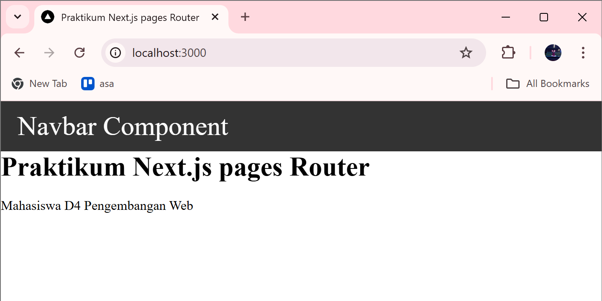


---

# 2. Membuat API Produk

Buat file API pada folder berikut:

```
pages/api/produk.js
```

Contoh kode API:

```javascript
export default function handler(req, res) {
  const data = [
    {
      id: "1",
      nama: "Kaos Polos",
      harga: 1000,
      ukuran: "M",
      warna: "Merah"
    },
    {
      id: "2",
      nama: "Kaos Berlengan Panjang",
      harga: 1500,
      ukuran: "M",
      warna: "Biru"
    }
  ];

  res.status(200).json({
    status: true,
    status_code: 200,
    data: data
  });
}
```

API ini berfungsi untuk mengirim data produk dalam bentuk **JSON response**.

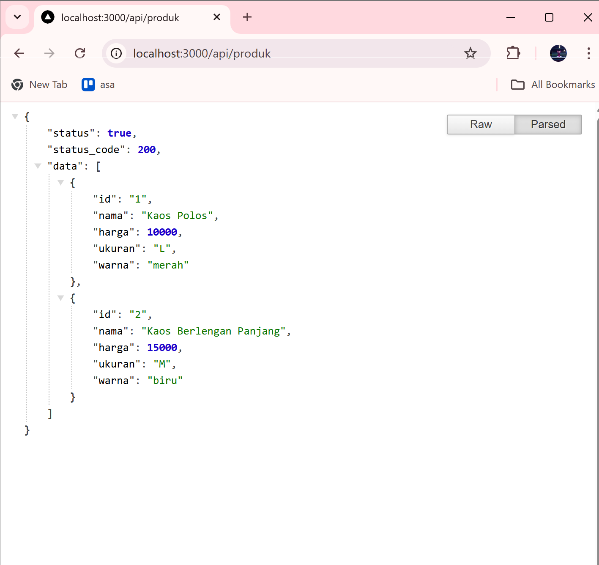


---

# 3. Fetch Data API di Frontend

Buka file berikut:

```
pages/product/index.tsx
```

Contoh kode fetch API:

```javascript
import { useEffect, useState } from "react";

export default function Produk() {

  const [products, setProducts] = useState([]);

  useEffect(() => {
    fetch("/api/produk")
      .then((response) => response.json())
      .then((data) => {
        setProducts(data.data);
      });
  }, []);

  return (
    <div>
      <h1>Daftar Produk</h1>

      {products.map((item) => (
        <div key={item.id}>
          <h3>{item.nama}</h3>
          <p>Harga : {item.harga}</p>
          <p>Ukuran : {item.ukuran}</p>
          <p>Warna : {item.warna}</p>
        </div>
      ))}

    </div>
  );
}
```
Frontend menggunakan **fetch API** untuk mengambil data dari endpoint `/api/produk`.

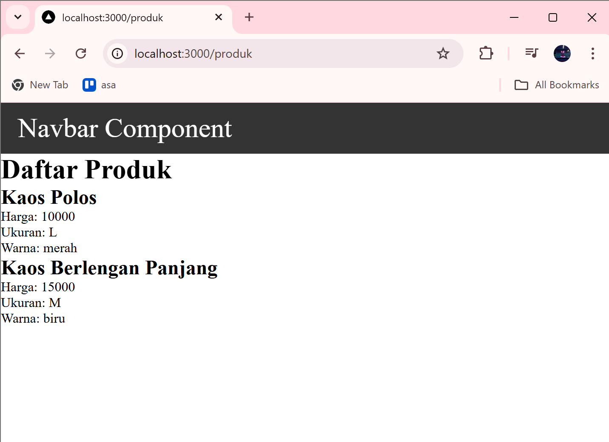

---

# 5. Setup Firebase

Langkah-langkah:

1. Buka **Firebase Console**
2. Login menggunakan akun Google
3. Klik **Create Project**
4. Nonaktifkan Google Analytics
5. Klik **Create Project**

Penjelasan singkat:
Firebase digunakan sebagai **backend service untuk menyimpan data produk**.

---

# Menambahkan Web App Firebase

Langkah-langkah:

1. Klik **Add App**
2. Pilih **Web**
3. Klik **Register App**
4. Salin konfigurasi Firebase

Penjelasan singkat:
Konfigurasi ini digunakan untuk menghubungkan aplikasi Next.js dengan Firebase.

---

# Mengaktifkan Firestore Database

Langkah-langkah:

1. Pilih menu **Firestore Database**
2. Klik **Create Database**
3. Pilih **Test Mode**
4. Klik **Enable**

Penjelasan singkat:
Firestore merupakan database **NoSQL** yang digunakan untuk menyimpan data aplikasi.

---

# Membuat Collection Products

Buat collection baru dengan nama:

```
products
```
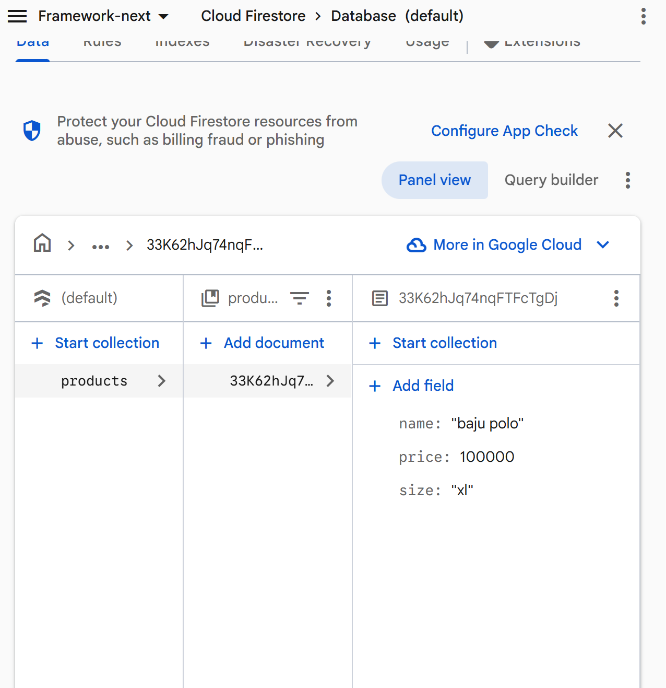

Collection ini digunakan untuk menyimpan data produk pada Firebase.

---

# 6. Install Firebase

Install library Firebase menggunakan perintah berikut:

```bash
npm install firebase
```

Penjelasan singkat:
Library ini memungkinkan aplikasi Next.js untuk berkomunikasi dengan Firebase.

---

# 7. Konfigurasi Environment Variable

Buat file baru:

```
.env.local
```

Isi dengan konfigurasi berikut:

```
FIREBASE_API_KEY=xxxx
FIREBASE_AUTH_DOMAIN=xxxx
FIREBASE_PROJECT_ID=xxxx
FIREBASE_STORAGE_BUCKET=xxxx
FIREBASE_MESSAGING_SENDER_ID=xxxx
FIREBASE_APP_ID=xxxx
```

Penjelasan singkat:
Environment variable digunakan untuk **menyimpan kredensial Firebase secara aman**.


---

# 8. Konfigurasi Firebase

Buat file berikut:

```
utils/db/firebase.ts
```

Contoh kode:

```javascript
import { initializeApp } from "firebase/app";

const firebaseConfig = {
  apiKey: process.env.FIREBASE_API_KEY,
  authDomain: process.env.FIREBASE_AUTH_DOMAIN,
  projectId: process.env.FIREBASE_PROJECT_ID,
  storageBucket: process.env.FIREBASE_STORAGE_BUCKET,
  messagingSenderId: process.env.FIREBASE_MESSAGING_SENDER_ID,
  appId: process.env.FIREBASE_APP_ID
};

const app = initializeApp(firebaseConfig);

export default app;
```

Penjelasan singkat:
File ini digunakan untuk menginisialisasi koneksi aplikasi dengan Firebase.

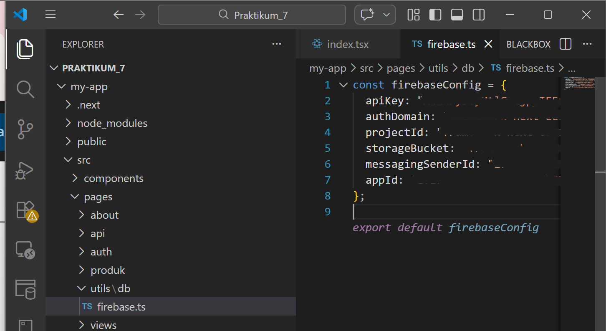

---

# 10. Mengambil Data dari Firestore

Buat file:

```
utils/db/servicefirebase.js
```

Contoh kode:

```javascript
import { collection, getDocs } from "firebase/firestore";
import { db } from "./firebase";

export async function retrieveProducts() {

  const querySnapshot = await getDocs(collection(db, "products"));

  const data = querySnapshot.docs.map((doc) => ({
    id: doc.id,
    ...doc.data()
  }));

  return data;
}
```

Penjelasan singkat:
Service ini digunakan untuk mengambil data produk dari **Firestore**.

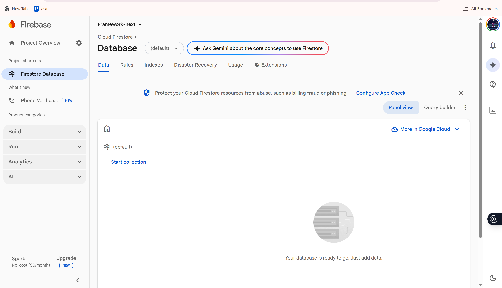

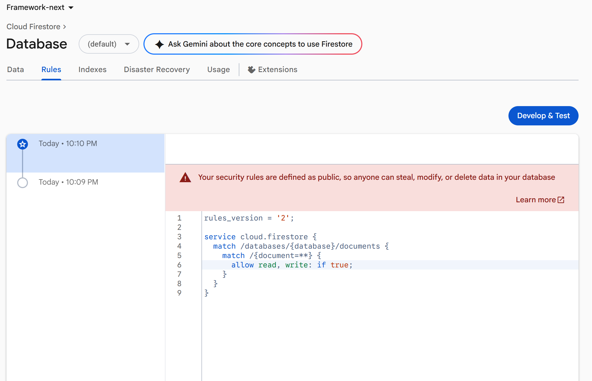
---

# API Mengambil Data Firebase

Edit file:

```
pages/api/product.js
```

Contoh kode:

```javascript
import { retrieveProducts } from "@/utils/db/servicefirebase";

export default async function handler(req, res) {

  const data = await retrieveProducts();

  res.status(200).json({
    status: true,
    status_code: 200,
    data: data
  });

}
```

Penjelasan singkat:
API ini berfungsi mengambil data dari Firebase lalu mengirimkannya ke frontend.

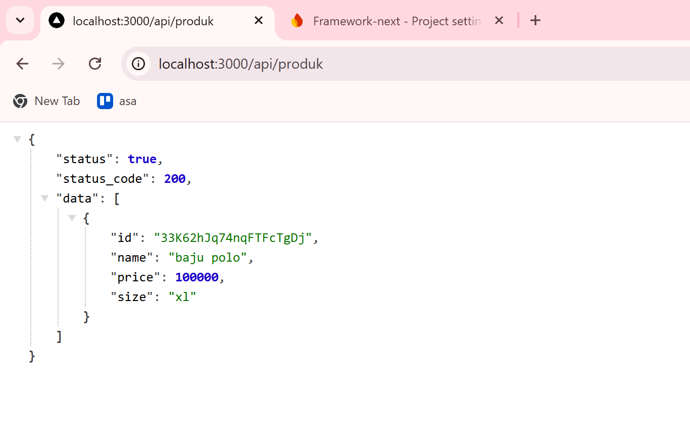

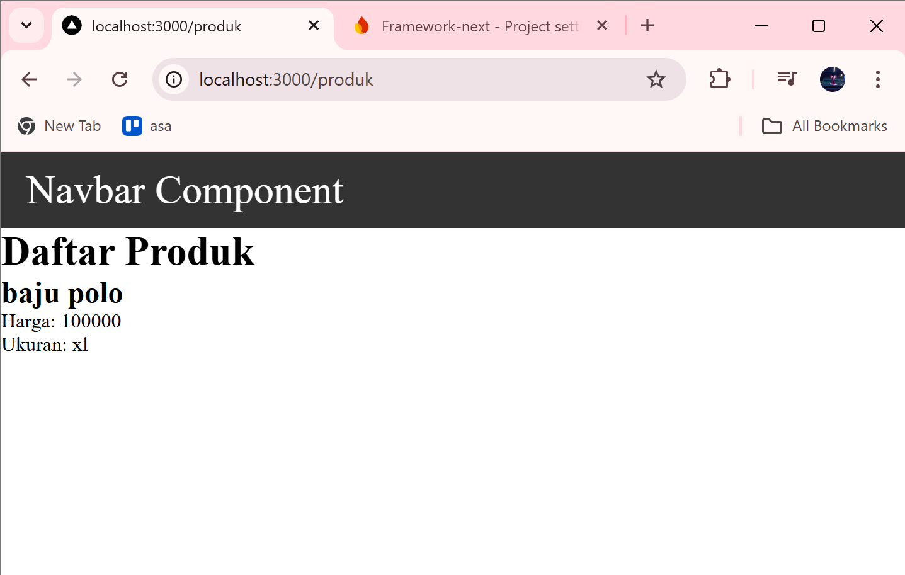

---

# Tugas
## Tugas 1
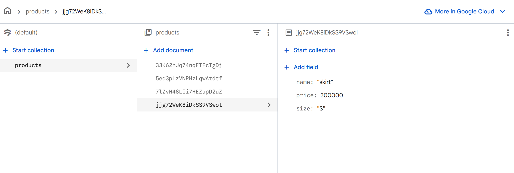

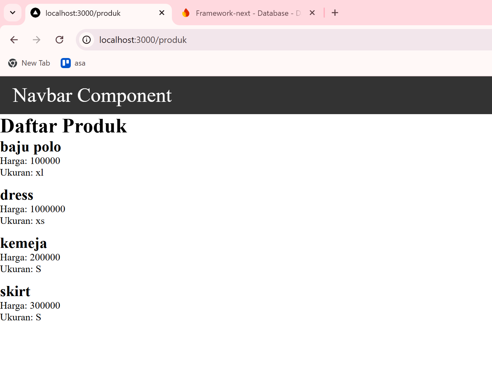
## Tugas 2
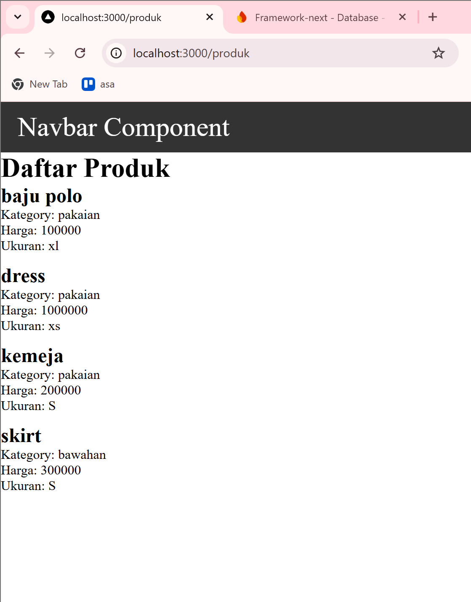

## Tugas 3
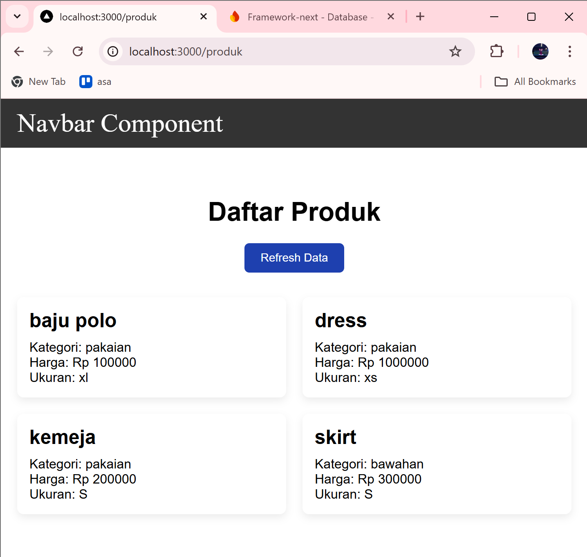

# Pertanyaan Evaluasi
1. Apa fungsi API Routes pada Next.js?
API Routes pada Next.js berfungsi untuk membuat endpoint API di dalam aplikasi Next.js sehingga aplikasi dapat menangani proses backend seperti mengambil data, mengirim data, dan menghubungkan aplikasi dengan database.

2. Mengapa .env.local tidak boleh di-push ke repository?
File .env.local tidak boleh di-push ke repository karena berisi informasi sensitif seperti API key, konfigurasi Firebase, dan credential lainnya yang harus dijaga keamanannya agar tidak diketahui oleh orang lain.

3. Apa perbedaan data statis dan data dinamis?

    - Data statis adalah data yang nilainya tetap dan tidak berubah kecuali jika kode program diubah.

    - Data dinamis adalah data yang dapat berubah dan biasanya diambil dari database atau API.

4. Mengapa Next.js disebut framework fullstack?
Next.js disebut framework fullstack karena dapat digunakan untuk mengembangkan frontend (tampilan website) sekaligus backend (API dan server logic) dalam satu framework yang sama.
