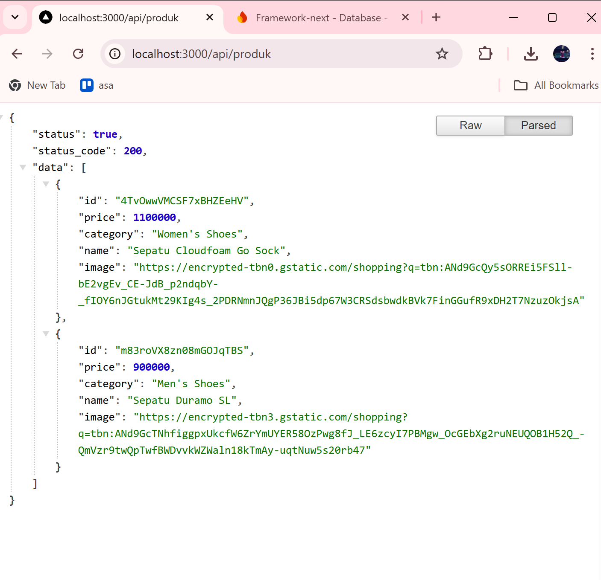
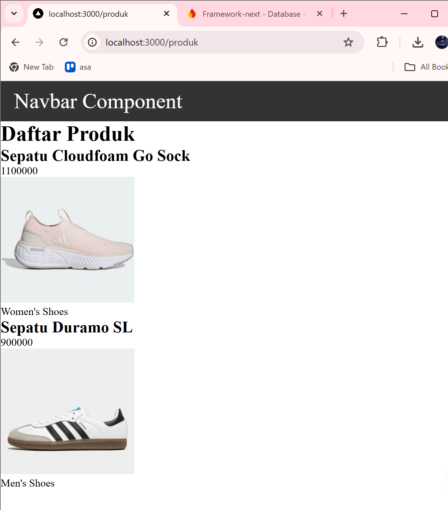
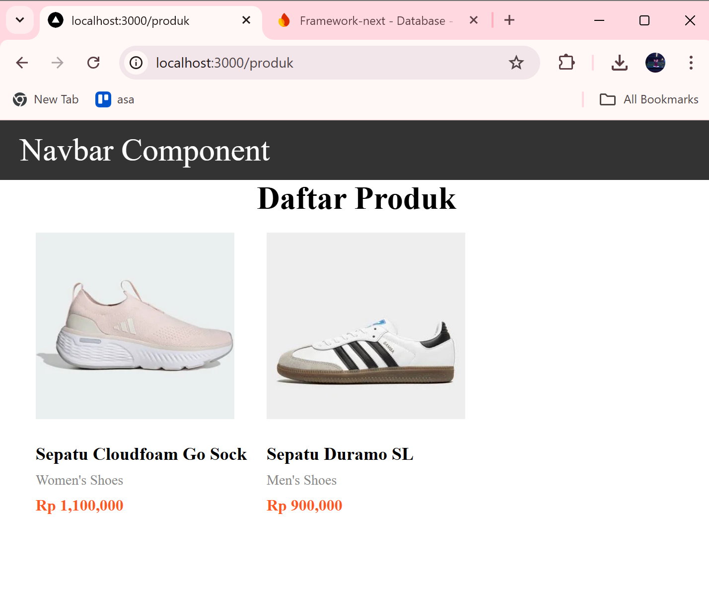

# Laporan Praktikum — Client Side Rendering & Data Fetching (Next.js + SWR)


## Bagian 1 — Setup Data Produk (Firebase + API)


Siapkan data produk minimal punya `id, name, category, price, image`, dan buat endpoint **/api/products**. 


---

## Bagian 2 — Implementasi CSR dengan useEffect


Data diambil setelah halaman dirender di client, jadi butuh state loading + conditional rendering.


Menambahkan tampilan menggunakan `produk.module.scss`

---

## Bagian 3 — Skeleton Loading + Animasi


Skeleton tampil saat isLoading === true agar UX tidak kosong, lalu diganti konten asli saat data sudah ada. 


Jika dijalankan akan muncul skeletonnya terlebih dahulu setelah itu muncul gambar
dan informasinya

---

## Bagian 5 — – Implementasi SWR

SWR mempermudah data fetching (loading/error) dan caching otomatis.

---

# Tugas 

## Tugas 1 

CSR (Client Side Rendering): Render awal minim, data diambil di browser setelah load → cocok app interaktif, ada delay awal.

SSR (Server Side Rendering): Render HTML di server tiap request → lebih SEO & konten cepat tampil, beban server lebih besar.

SSG (Static Site Generation): HTML dibuat saat build time → paling cepat, cocok konten jarang berubah.

## Tugas 2
Buat halaman produk dengan:

    o Skeleton loading
    o Animasi

Menaruh kode berikut pada `produk.module.scss`
```ts
&__skeleton {
      width: 200px;
      padding: 16px;
      border: 1px solid #eee;
      border-radius: 8px;
      box-shadow: 0 2px 4px rgba(0, 0, 0, 0.1);

      display: flex;
      flex-direction: column;
      align-items: center;

      animation: identifier 1.5s infinite ease-in-out;
}
```
menghasilkan tampilan


## Tugas 3
Refactor kode dari useEffect menjadi SWR!

useEffect manual diganti SWR agar fetch lebih rapi (loading/error) dan caching.

``` ts
const fetcher = (url: string) => fetch(url).then((res) => res.json());

export default fetcher;
```

hasilnya

