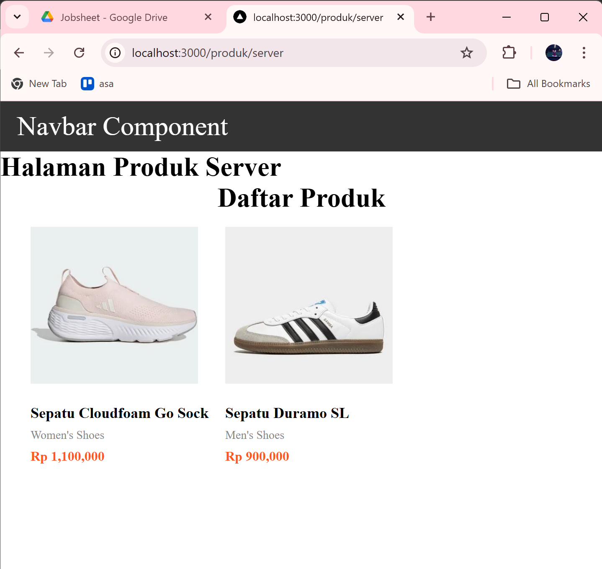

# Laporan Praktikum : Server Side Rendering (SSR) – Next.js

**Mata Kuliah:** Pemrograman Berbasis Framework  
**Topik:** Server Side Rendering (SSR)  

---

# Praktikum Server Side Rendering (SSR)

## Bagian 1 – Setup Halaman SSR

### Screenshot Hasil

### Penjelasan

Pada bagian ini dilakukan pembuatan halaman SSR pada Next.js dengan membuat file baru **server.tsx** di dalam folder **pages/products**. Halaman ini digunakan untuk menampilkan daftar produk yang akan dirender dari sisi server.

Setelah file dibuat, halaman dapat diakses melalui URL: `http://localhost:3000/produk/server`

Halaman tersebut menampilkan judul **Halaman Produk Server** dan komponen **TampilanProduk** yang menerima props berupa daftar produk. Pada tahap ini data produk masih berupa array kosong.

---

# Bagian 2 – Implementasi getServerSideProps

### Screenshot Hasil

### Penjelasan

Pada bagian ini ditambahkan fungsi **getServerSideProps** pada file **server.tsx**. Fungsi ini digunakan untuk mengambil data produk dari API sebelum halaman dirender oleh server.

---

# Bagian 3 – Refactor Type (Product Type)

### Screenshot Struktur Folder

### Penjelasan

Pada bagian ini dilakukan refactor tipe data produk agar kode menjadi lebih rapi dan terstruktur. Dibuat folder **types** di dalam folder **pages** dan file **Product.type.ts**.

File tersebut berisi definisi tipe data produk seperti:

- id
- name
- price
- image
- category

Dengan adanya tipe data ini, komponen yang menggunakan data produk akan lebih mudah dalam melakukan validasi data serta meningkatkan keterbacaan kode.

---

# Bagian 4 – Uji Perbedaan SSR vs CSR

## Uji 1 – Skeleton Loading

### Screenshot

### Penjelasan

Pada halaman **CSR**, ketika halaman di-refresh akan muncul **skeleton loading** terlebih dahulu sebelum data produk muncul.

Sedangkan pada halaman **SSR**, skeleton tidak muncul karena HTML sudah dirender di server dan langsung dikirim ke browser. Hal ini sesuai dengan karakteristik SSR dimana **HTML sudah lengkap saat diterima oleh client**.

---

## Uji 2 – Network Tab

### Screenshot 

### Penjelasan

Pada halaman **CSR**, ketika halaman direfresh akan terlihat request API pada **Network Tab (XHR)** karena browser melakukan fetch data secara langsung.

Sedangkan pada halaman **SSR**, request API tidak terlihat di Network Tab karena proses pengambilan data dilakukan di server sebelum halaman dikirim ke browser.

---

## Uji 3 – Response HTML

### Screenshot View Source CSR

### Screenshot View Source SSR

### Penjelasan

Perbedaan HTML pada CSR dan SSR dapat dilihat melalui **View Page Source**.

Pada **CSR**, HTML awal yang dikirim ke browser masih kosong dan hanya berisi skeleton atau struktur dasar aplikasi.

Sedangkan pada **SSR**, HTML yang dikirim ke browser sudah berisi data produk lengkap karena proses rendering dilakukan di server.

---

# Tugas Praktikum

---

# Studi Analisis

## 1. Mengapa SSR lebih baik untuk SEO?

SSR lebih baik untuk SEO karena HTML yang dikirim ke browser sudah berisi konten lengkap. Hal ini memudahkan crawler mesin pencari seperti Google untuk membaca isi halaman tanpa harus menjalankan JavaScript terlebih dahulu.

Dengan demikian, halaman yang menggunakan SSR memiliki peluang lebih besar untuk terindeks dengan baik oleh mesin pencari.

---

## 2. Kapan sebaiknya menggunakan SSR?

SSR sebaiknya digunakan pada kondisi berikut:

- Website yang membutuhkan **SEO yang baik**
- Halaman yang membutuhkan **data yang selalu terbaru**
- Website yang memerlukan **rendering cepat saat pertama kali dibuka**
- Website seperti **e-commerce, blog, atau portal berita**

---

## 3. Apa kekurangan SSR dibanding CSR?

Meskipun memiliki banyak kelebihan, SSR juga memiliki beberapa kekurangan:

- Beban kerja server menjadi lebih berat karena rendering dilakukan di server.
- Waktu respon server bisa meningkat jika banyak request.
- Implementasi lebih kompleks dibanding CSR.
- Setiap request akan memanggil proses fetching data di server.

---

## 4. Mengapa skeleton tidak muncul pada SSR?

Skeleton tidak muncul pada SSR karena proses pengambilan data dilakukan di server sebelum halaman dikirim ke browser. Ketika browser menerima halaman, HTML sudah berisi data lengkap sehingga tidak diperlukan loading state seperti skeleton.
